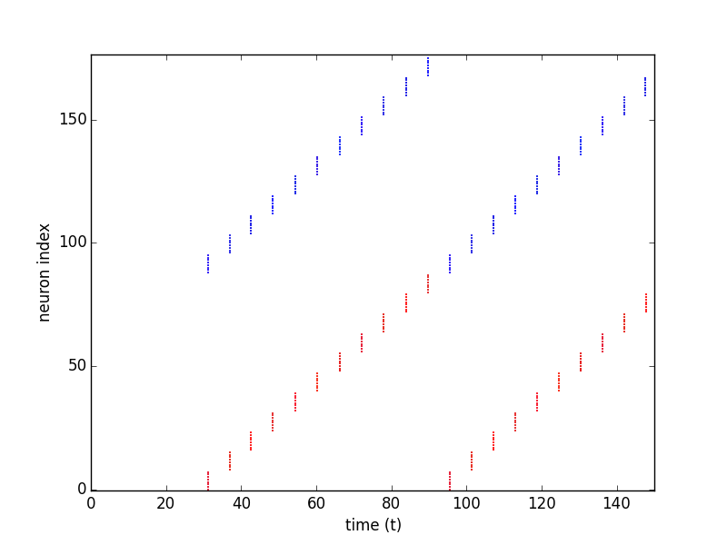

.. _building_models:

===============
Building models
===============

The Neuromorphic Computing Platform executes experiments performed on computational models of neuronal networks.
Both the experiment description and the model description must be written as Python scripts,
using the PyNN_ application programming interface (API).

The PyNN model description API
==============================

PyNN is a Python package which defines an API for defining neuronal network models with spiking neurons in a
simulator-independent way.
There are implementations of this API for the NEST, NEURON and Brian simulators
and for both of the HBP Neuromorphic Computing systems (PM and MC/SpiNNaker).
In this documentation, we refer to each of these simulators and hardware platforms as a PyNN "**backend**".

Full documentation of the API is available at:

  | `PyNN 0.6 documentation`_

  | `PyNN 0.7 documentation`_

  | `PyNN 0.8 documentation`_

At the time of writing, both the PM and MC systems implement version 0.7 of the API,
while the simulator of the PM hardware (:doc:`ESS<pm/ess>`) supports both versions 0.7 and 0.8,
and the chip-based PM hardware (:doc:`Spikey<pm/spikey>`) supports version 0.6.

A simple example
================

We present here a simple example network, a toy model of a "synfire chain",
in which the activity propagates across the network.

As with any Python script, the first step is to import the external libraries that we will use.
Here we import the NEST backend of PyNN for the simulation, NumPy for random number generation, and matplotlib
for plotting.

.. literalinclude:: examples/synfire_chain.py
   :start-after: Import external libraries
   :end-before: Parameters

Next we define numerical parameters, such as the number and size of neuronal populations, neuron properties,
synaptic weights and delays, etc.

.. literalinclude:: examples/synfire_chain.py
   :start-after: Parameters
   :end-before: Configure the simulator/hardware

The :func:`setup()` function initializes and configures the simulator (in this case NEST).

.. literalinclude:: examples/synfire_chain.py
   :start-after: Configure the simulator/hardware
   :end-before: Create populations of neurons

The main building block in PyNN is a population of neurons of the same type (although the parameters of the neurons
within the population can be heterogeneous).
Here we create 11 populations of excitatory integrate-and-fire (IF) neurons and 11 populations of inhibitory IF neurons.

.. literalinclude:: examples/synfire_chain.py
   :start-after: Create populations of neurons
   :end-before: Connect the populations in a chain

We now connect each excitatory population to the following pair of excitatory and inhibitory populations,
and each inhibitory population to the excitatory population within the same pair.

.. literalinclude:: examples/synfire_chain.py
   :start-after: Connect the populations in a chain
   :end-before: Create and connect stimulus

The first pair of populations are stimulated by a burst of spikes.

.. literalinclude:: examples/synfire_chain.py
   :start-after: Create and connect stimulus
   :end-before: Set-up recording

We've now finished building the network, now we instrument it, by recording spikes from all populations.

.. literalinclude:: examples/synfire_chain.py
   :start-after: Set-up recording
   :end-before: Run the simulation

Now we run the simulation:

.. literalinclude:: examples/synfire_chain.py
   :start-after: Run the simulation
   :end-before: Plot spike raster

Finally we loop over the populations, retrieve the spike times, and plot a raster plot (spike time vs neuron index).

.. literalinclude:: examples/synfire_chain.py
   :start-after: Plot spike raster

Note that here we include the plotting in the same script just to illustrate the example output.
Scripts submitted to the Neuromorphic Computing Platform should not in general contain graph plotting or data
analysis code. Instead you should save spikes to file and use the other tools available in the `Collaboratory`_ for
analysing and visualizing the results.

.. _using-different-backends:

Using different backends
========================

To run the same simulation with a different simulator, just change the name of the PyNN backend to import, e.g.:

.. code-block:: python

    import pyNN.neuron as sim

to run the simulation with NEURON. For the PM system, the module to import is ``pyNN.hardware.hbp_pm`` while for the
MC system the module is ``pyNN.spiNNaker``.

The recommended approach is to provide the name of the backend as a command-line argument,
i.e., you run your simulation using:

.. code-block:: bash

   $ python run.py nest

PyNN contains some utility functions to make this easier. With PyNN 0.7, use:

.. code-block:: python

    from pyNN.utility import get_script_args
    simulator_name = get_script_args(1)[0]
    exec("import pyNN.%s as sim" % simulator_name)

With PyNN 0.8:

.. code-block:: python

    from pyNN.utility import get_simulator
    sim, options = get_simulator()

"Physical model" (BrainScaleS) system
=====================================

The BrainScaleS system has a number of additional configuration options that can be passed to :func:`setup()`. These are
explained in :ref:`nmpm1-hardware-configuration`.
There are also a number of limitations, for example only a subset of the
PyNN standard neuron and synapse models are available.

The BrainScaleS system attempts to automatically place neurons on the wafers in an optimal way. However, it is possible to
influence this placement or control it manually. An example can be found in :ref:`label-marocco-example`.

"Many core" (SpiNNaker) system
==============================

The SpiNNaker system supports the standard arguments provided by the PyNN :func:`setup()` function.  The SpiNNaker system has a number of limitations in terms of the support for PyNN functionality, for example, only a subset of the PyNN standard neuron and synapse models are currently available. These limitations are defined in the online documentation `here <http://spinnakermanchester.github.io/latest/spynnaker_limitations.html>`__.

The SpiNNaker software stack attempts to automatically partition the populations
defined in the PyNN script into core sized chunks (the smallest atomic size of
resource for a machine) of neurons which are then placed onto the machine in an
optimal way in regard to the machine's available resources. However, it is
possible to influence the partitioning and placement behaviours manually.

For example, take the PyNN definition of a population from the "synfire chain"
example discussed previously, and shown below:

.. code-block:: python

    populations[syn_type] = sim.Population(population_size,
                                           sim.IF_cond_exp,
                                           neuron_parameters)

A partitioning limitation/constraint can be added to the population, which can
limit how many neurons each core size chunk will contain at a maximum. This is
shown below:

.. code-block:: python

    populations[syn_type] = sim.Population(population_size,
                                           sim.IF_cond_exp,
                                           neuron_parameters)
    populations[syn_type].add_constraint(sim.PartitionerMaximumSizeConstraint(200))

This and other examples of manual limitations can be found in the online
documentation `here <http://spinnakermanchester.github.io/latest/spynnaker_tutorial.html>`__.

.. _PyNN: http://neuralensemble.org/PyNN/
.. _`PyNN 0.6 documentation`: http://neuralensemble.org/trac/PyNN/
.. _`PyNN 0.7 documentation`: http://neuralensemble.org/trac/PyNN/
.. _`PyNN 0.8 documentation`: http://neuralensemble.org/docs/PyNN/
.. _`Collaboratory`: https://collab.humanbrainproject.eu
