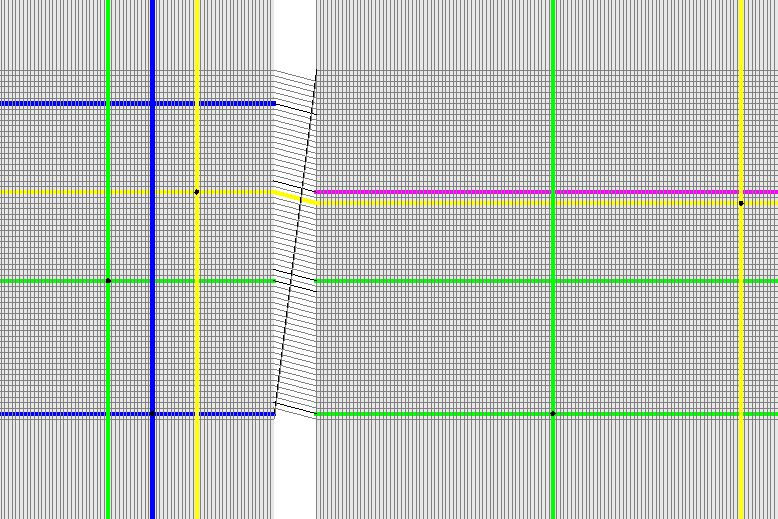

=======
Marocco
=======

Code documentation is provided by ``doxygen`` and can be accessed here:
https://brainscales-r.kip.uni-heidelberg.de:8443/view/doc/job/doc-dsl_marocco/marocco_Documentation

On a cluster frontend nodes (ice/ignatz/dopamine) or a vertical setup host:

------------
Installation
------------

Create and change to a directory for your projects, preferably on wang, e.g.: ``/wang/users/<somebody>/cluster_home/projects``.

ssh-agent
^^^^^^^^^

To reduce the amount of typing, please consider using ``ssh-agent`` to cache your key password:

.. code-block:: bash

	eval `ssh-agent`
	ssh-add ~/path/to/your/private_id_rsa

waf
^^^

This step is optional as the default environment already provides a ``waf`` executable.
However, if you need a customized waf version:

.. code-block:: bash

	git clone git@gitviz.kip.uni-heidelberg.de:waf.git -b symwaf2ic visions-waf
	make -f visions-waf/Makefile
	ln -f visions-waf/waf .
	alias waf=$PWD/waf

pyhmf, marocco and dependencies
^^^^^^^^^^^^^^^^^^^^^^^^^^^^^^^

Then create and change to a directory for marocco, e.g., `/wang/users/somebody/cluster_home/projects/marocco`:

.. code-block:: bash

    waf setup --project pyhmf --project=marocco --without-ester
    waf configure
    waf install --test-execnone
    # some extra targets are needed
    waf install --target=pyhalbe,pysthal,redman_xml --test-execnone

including cake (optional):

.. code-block:: bash

    waf setup --project pyhmf --project marocco --project cake --without-ester
    waf configure
    waf install --test-execnone
    # some extra targets are needed
    waf install --target=pyhalbe,pysthal,redman_xml,pycake --test-execnone

including support for ESS add ``--with-ess`` to setup call.

paths
^^^^^

To include the local paths in your environment, please use:

.. code-block:: bash

        module load localdir
        module load pynn/0.7.5

Another method would be to create an init file and put all the needed parts into a script:

.. code-block:: bash

	echo "INSTALLED_LIB_PATH=$(readlink -e lib)" > init.sh
	cat >>init.sh<<EOF
	export LD_LIBRARY_PATH=$LD_LIBRARY_PATH:\${INSTALLED_LIB_PATH}
	export PYTHONPATH=$PYTHONPATH:\${INSTALLED_LIB_PATH}
	module load pynn/0.7.5
	EOF

In every (!) fresh shell you now have to source the ``init.sh``:

.. code-block:: bash

	source path/to/init.sh

Check if the installation and the setup of variables is fine:

.. code-block:: bash

	python -c "import pyhmf" && echo ok

should print ``ok``, if instead:

.. code-block:: python

	Traceback (most recent call last):
	  File "<string>", line 1, in <module>
	ImportError: No module named pyhmf

occurs, either the installation failed or the environment variables responsible for finding the module are wrong. In that case, double check if you followed the instructions 1:1.

-----
Usage
-----

Backends
^^^^^^^^

Available backends: None, Hardware, ESS. None does only mapping and routing (a dry run). Hardware runs on the real neuromorphic hardware. ESS runs the executable system specification (not yet fully functional).

Calibration
^^^^^^^^^^^

To change the calibration backend from database to XML set "calib_backend" to XML. Then the calibration is looked up in xml files named @w0-h84.xml@, @w0-h276.xml@, etc. in the directory "calib_path".

XML files can be found at [[cake:Calibration data]].

Running pyNN scripts
^^^^^^^^^^^^^^^^^^^^

For *mapping* only:

.. code-block:: bash

	LD_PRELOAD=/usr/lib/openmpi/lib/libmpi.so python main.py

If you don't preload libmpi, the error message is:

.. code-block:: bash

	python: symbol lookup error: /usr/lib/openmpi/lib/openmpi/mca_paffinity_linux.so: undefined symbol: mca_base_param_reg_int

To run on the *hardware* one needs to use the slurm job queue system:

.. code-block:: bash

	srun -p wafer python main.py

main.py:

.. code-block:: python

	import numpy as np
	import pyhmf as pynn
	from pymarocco import PyMarocco
	import pyredman
	from pyhalbe.Coordinate import HICANNGlobal, X, Y, Enum
	import pylogging, pyhalbe
	pyhalbe.Debug.change_loglevel(2)
	pylogging.set_loglevel(pylogging.get("marocco"), pylogging.LogLevel.TRACE)
	pylogging.set_loglevel(pylogging.get("sthal"), pylogging.LogLevel.DEBUG)
	pylogging.set_loglevel(pylogging.get("Default"), pylogging.LogLevel.INFO)

	marocco = PyMarocco()
	marocco.placement.setDefaultNeuronSize(4)
	#marocco.backend = PyMarocco.Hardware # uncomment to run on hardware
	#marocco.backend = PyMarocco.ESS      # uncomment to run on hardware

	marocco.calib_backend = PyMarocco.XML # load calibration from xml files
	marocco.calib_path = "/wang/data/calibration/wafer_0"

	use=HICANNGlobal(Enum(276)) # choose hicann
	marocco.analog_enum = 0
	marocco.hicann_enum = use.id().value()

	#output
	marocco.membrane = "membrane.dat" # voltage trace
	marocco.wafer_cfg = "wafer.xml"   # configuration
	marocco.roqt = "foo.roqt"         # visualization

	marocco.bkg_gen_isi = 10000

	#example for blacklisting, one pyredman.Hicann instance per HICANN
	#h = pyredman.Hicann()
	#h.drivers().disable(SynapseDriverOnHICANN(C.right, C.Y(4)))
	#h.neurons().disable(NeuronOnHICANN(Enum(0)))
	#marocco.defects.inject(HICANNGlobal(Enum(277)), h)

	pynn.setup(marocco=marocco)

	duration = 30000 #ms

	params = {
					'cm'            :   0.2, # needed?
					'v_reset'       :  -70,
					'v_rest'        :  -50,
					'v_thresh'      :  -10, # -47 for spikes
					'e_rev_I'       : -60,
					'e_rev_E'       : -40,
	}

	neurons = pynn.Population(5, pynn.IF_cond_exp, params)
	neuron = pynn.PopulationView(neurons, [0])
	neuron.record_v() # enable recording of voltage trace

	marocco.placement.add(neurons, use)

	width = 1000
	isi = 25
	numExc = 5

	spike_times = list(np.concatenate([np.arange((i-1)*width,i*width,isi,dtype=float) for i in range(1,duration/width*2+2,2)]))
	in_0 = pynn.Population(numExc, pynn.SpikeSourceArray, {'spike_times':spike_times}) # spike times in ms

	w_exc =  0.004

	con = pynn.FixedProbabilityConnector(
		p_connect=1.0,
		allow_self_connections=True,
		weights=w_exc)

	proj0 = pynn.Projection(in_0, neurons, con, target='excitatory')

	pynn.run(duration) # ms
	pynn.end()

	spikes = neurons.getSpikes()
	print spikes
	print "N spikes", len(spikes)
	np.savetxt("spikes.dat",spikes)

Load redman backend::

	from pymarocco import PyMarocco
	from pycake.helpers.redman import Redman
	import Coordinate as C

	hicann_id = 276
	hicann_coord_global = C.HICANNGlobal(C.Enum(hicann_id))
	redman_backend_path = "/wang/data/calibration/wafer_0" # containing e.g. hicann-Wafer(0)-Enum(276).xml

	marocco = PyMarocco()

	r = Redman(calibration_path, hicann_coord_global)
	marocco.defects.inject(hicann_coord_global, r.hicann_with_backend)

If pyNN.recording.files cannot be imported, pyNN is missing from your paths:

.. code-block:: python

	Traceback (most recent call last):
	  File "main.py", line 5, in <module>
		import pyhmf as pynn
	ImportError: No module named pyNN.recording.files

Inspect the Configuration
^^^^^^^^^^^^^^^^^^^^^^^^^

.. code-block:: bash

    sthal/tools/dump_cfg.py

================================
Job queue Demo - HBP Summit 2014
================================

On dopamine or some other cluster frontend:

.. code-block:: bash

	cd somewhere-on-your-wang:

	socksify git clone https://github.com/electronicvisions/hbp_platform_demo

	cd hbp_platform_demo

	module load pynn
	module load mongo
	module load PlatformDemo/20140924_sschmitt

	srun -p wafer python run.py nmpm1

	*wait*

	display result.png

====================
roqt (Visualization)
====================

You need to be in the roqt directory, because the ui file is loaded by a relative path:

.. code-block:: bash

    cd marocco/tools/roqt
    PYTHONPATH=$PWD/lib:$PYTHONPATH bin/roqt /some/path/to/roqt.bin

      
      Routing visualization of the roqt visualization tool.
