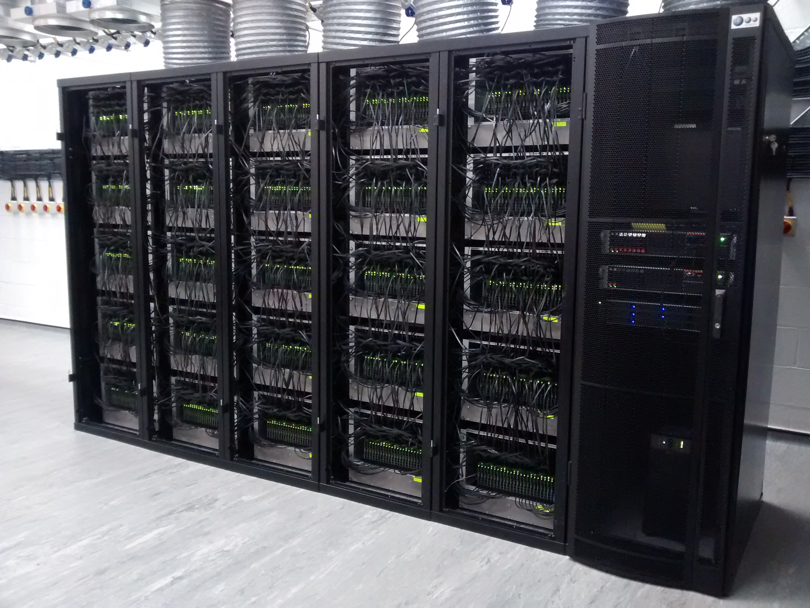

================================
The SpiNNaker "many core" system
================================

The MC-1 machine is designed to utilise the power of digital hardware and
support various models/application though the use of programmable software that
can run on ARM cores. A description of the hardware can be located online `here <http://apt.cs.manchester.ac.uk/projects/SpiNNaker/>`__.

The MC-1 relies upon software support to allow the PyNN interface to execute
on the MC-1 machine; This ranges from low level software (known as `spinnaker_tools <https://github.com/SpiNNakerManchester/spinnaker_tools>`__, including `SARK <https://github.com/SpiNNakerManchester/spinnaker_tools/tree/2016.001/docs/sark.pdf>`__, the `Spin1API <https://github.com/SpiNNakerManchester/spinnaker_tools/tree/2016.001/docs/spinn_api_doc.pdf>`__ and `ybug <https://github.com/SpiNNakerManchester/spinnaker_tools/tree/2016.001/docs/ybug.pdf>`__) to high level software that takes a graph representation of an application (in
this case a PyNN description of a Neural network) and maps, optimises and
executes this application on the MC-1 hardware and supports the retrieval of
application data generated during the applications execution.

Details of the latest version of the high level software can be found `here <https://spinnakermanchester.github.io>`__, and the source code can be seen `here <https://github.com/SpiNNakerManchester/sPyNNaker/tree/2016.001>`__.

.. _SpiNNaker-system-photo:

      The SpiNNaker 500.000 core system (NM-MC1) in Manchester on 25 March 2016

Supported PyNN Functionality
============================

The MC-1 PyNN module within the software stack (named sPyNNaker) currently supports a subset of the standard `PyNN 0.7 API <http://neuralensemble.org/trac/PyNN/wiki/API-0.7>`__. The supported interface functions can be found in the `online documentation <http://spinnakermanchester.github.io/latest/spynnaker_limitations.html>`__.

In the next planned release, it is planned that the remaining missing features of PyNN 0.75 will be implemented, along with some initial support for PyNN 0.8.

Available hardware setups
=========================

There are currently four known hardware setups:

- Jorg Conradt’s one-node board.  This is a single SpiNNaker chip that is produced at TU Munchen and is intended for light-weight near-robotic applications.

- A single 4-chip board.  These are commonly used at SpiNNaker workshops.  There are a number of these boards in boxes.

- A single 48-chip board.  This is the standard building block of SpiNNaker machines, but each board can be used in isolation.  As with the 4-chip boards, a number of 48-node boards are available in boxes.

- A stand-alone toroid.  A number of individual 48-node boards can be wired together as a single machine. Additionally, the edges can be wired so that the machine forms a toroidal mesh of chips.

- The 600 board machine.  This is the machine that is currently running behind the HBP portal.  This machine can be broken into smaller multi-board machines through the use of the spalloc software; this allows a number of smaller jobs to run simultaneously on the machine, as well as allowing a single large job to use the whole half-million cores available.

When using the HBP portal, allocation of the machine is done by estimating the size of board required by the given PyNN script.  The network is broken down and mapped on to a virtual machine (see below) as described in _`Mapping and Routing`, and then a machine of an appropriate size is allocated.  The remaining mapping and routing algorithms are then run as normal.

The software also supports the ability to run in virtual mode, where the tools execute the PyNN script as if it was linked to a direct SpiNNaker machine, but without actually generating any simulated data. This supports end users in testing their scripts for basic compilation errors before loading them into the HBP portal.  Instructions on how to use this functionality can be found `here <http://spinnakermanchester.github.io/latest/virtual.html>`__.

Mapping and Routing
===================

The mapping process examines the neural network definition and attempts to break it down in to parts, each of which can be executed on a SpiNNaker core.  A routing algorithm is then run to work out the communication paths between the cores on the SpiNNaker network.  In the current software, mapping and routing takes place on the host machine as part of the placement and configuration manager (PACMAN).

It is possible for end users to add their own mapping and routing algorithms into the tool chain.  Instructions on how to do so can be found `here <http://spinnakermanchester.github.io/latest/mapping_algorithms.html>`__.
