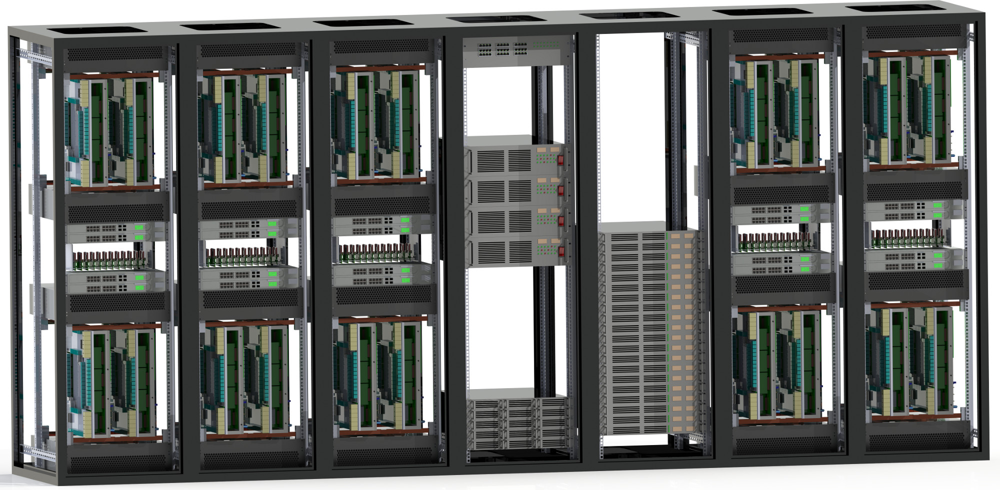
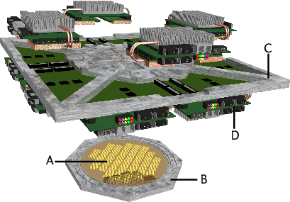
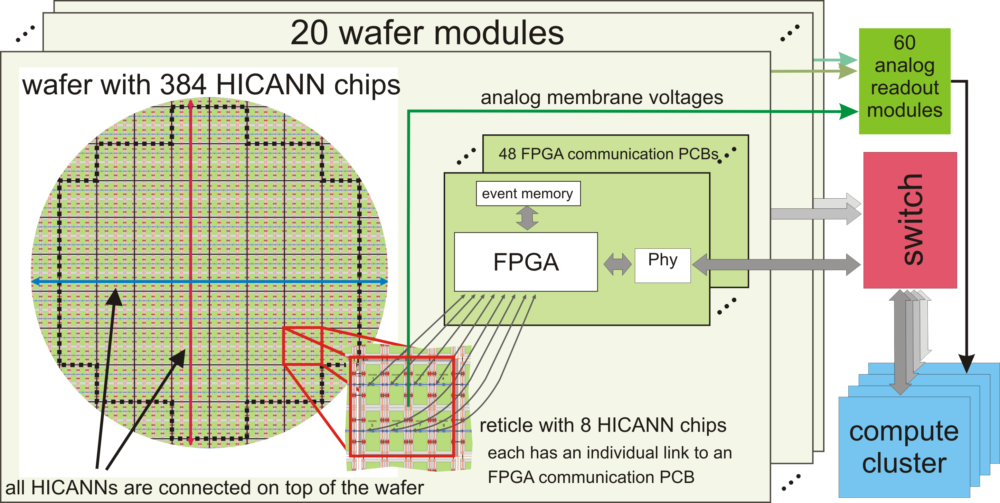

.. _nmpm1-hardware-configuration:

======================
Hardware configuration
======================

.. _nmpm1-hardware-figure:

      The BrainScaleS (NM-PM-1) system: five 19-inch racks contain 20 neuromorphic wafer modules (cf. :num:`waferscale-hardware-figure`), the other two racks carry power supplies and a conventional control cluster.

At the core of the BrainScaleS wafer-scale hardware system (see Figure :num:`waferscale-hardware-figure`) is an uncut wafer built from mixed-signal ASICs [#f1]_,
named `High Input Count Analog Neural Network` chips (`HICANNs`), that provide a highly configurable substrate which physically emulates adaptively spiking neurons and dynamic synapses (`Schemmel et al. (2010)`_, `Schemmel et al. (2008)`_).
The intrinsic time constants of these VLSI model circuits are multiple orders of magnitude shorter than their biological originals.
Consequently, the hardware model evolves with a speedup factor of :math:`10^3` up to :math:`10^5` compared to biological real time, the precise value depending on the configuration of the system.
This speedup enables power-efficient computation as the energy consumption for synaptic transmissions is several orders of magnitude lower than in classically simulated neuronal networks.

.. _waferscale-hardware-figure:

    
      The BrainScaleS wafer-scale hardware system: Wafer comprising HICANN building blocks and on-wafer communication infrastructure, mechanical infrastructure (top cover and insertion frame), analog readout boards (AnaB), power supply and digital inter-wafer as well as wafer-host communication modules.

In addition to a high-bandwidth asynchronous on-wafer event communication infrastructure, 48 FPGA [#f2]_ communication modules provide off-wafer connectivity (to other wafers and to host computers).

A full wafer system comprises 384 interconnectable HICANNs, each of which implements more than 114,688 programmable dynamic synapses and up to 512 neurons, resulting in a total of approximately 44 million synapses and up to 196,608 neurons per wafer module.
The exact number of neurons depends on the configuration of the substrate, which allows to combine multiple neuron building blocks to increase the input count per cell.

Via the communication FPGAs the system can be configured and operated from a host computer.
Each communication FPGA is connected to a dedicated area on the wafer which contains 8 HICANNs.
This FPGA-HICANN link is used to configure the HICANNs as well as to transmit pulse events to and from the neural circuits on the wafer.
The pulse communication between the on-wafer neurons is performed by a bus-like network directly on the wafer.

The system provides a high degree of configurability with respect to network architecture and neuron parameters:

  * each neuron provides configurable AdEx neuron dynamics
  * the synapses provide 4-bit weight resolution and STDP functionality
  * the connection topology can be configured

For a detailed specification see HBP deliverable `D9.7.1`_.

.. _D9.7.1: https://flagship.kip.uni-heidelberg.de/jss/FileExchange?s=qqdXDg6HuX3&uID=65

.. _nmpm1-overview-figure:

      The left area illustrates the partitioning of HICANNs into larger units (reticles) and the data flow up to the control cluster.

Figure :num:`nmpm1-overview-figure` provides a simplified overview of the BrainScaleS system.
The support infrastructure is responsible for power supply, off-wafer communication and analog readout functionality.
A dedicated Raspberry Pi embedded computer monitors and controls all power links as well as other operating parameters of the wafer system.
Analog readout (e.g., recording of membrane voltages) functionality is provided by a custom analog readout module (AnaRM).
Several AnaRMs are handled by another dedicated control computer.
The control/compute cluster orchestrates the configuration of the system and the execution of neuronal network experiments including all input and output data of the emulated network.
All hardware resources (neuromorphic and support hardware as well as conventional compute resources) are managed by `SLURM`_.

.. _BrainScaleS-system-photo:

.. figure:: 6D_0073294_Racks_19WaferSystemsInstalled_30March2016_cropped_1000px.jpg
      :width: 100%
      :alt: The BrainScaleS physical system in Heidelberg on 30 March 2016.

      The BrainScaleS (NM-PM-1) system in Heidelberg on 30 March 2016

.. _SLURM: http://slurm.schedmd.com

.. [#f1] Application Specific Integrated Circuit
.. [#f2] Field Programmable Gate Array

.. _`Schemmel et al. (2010)`: http://ieeexplore.ieee.org/xpls/abs_all.jsp?arnumber=5536970
.. _`Schemmel et al. (2008)`: http://ieeexplore.ieee.org/xpls/abs_all.jsp?arnumber=4633828
