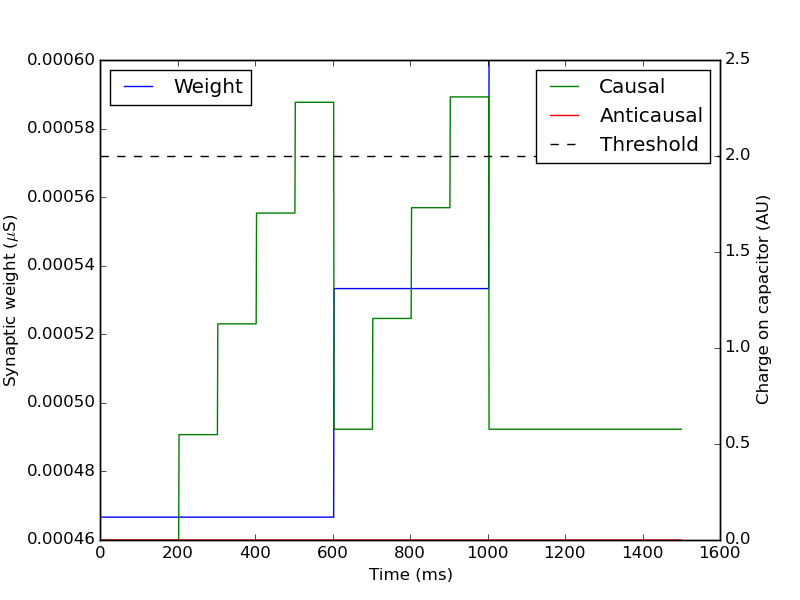

Frequently asked questions (FAQ)
================================

For contact information, frequently asked questions and further documentation, please visit our `website <http://www.kip.uni-heidelberg.de/spikey>`_.

Characterization of analog circuits
-----------------------------------

For measurements of analog circuits see [Bruederle2009PhD]_.
Note that version 3 of the Spikey chip was used in this thesis.

NEST model of hardware STDP synapses
------------------------------------

In the scope of [Pfeil2012STDP] we implemented an STDP synapse in NEST considering the following features of STDP synapses on the Spikey chip:

* Local measurement and accumulation of correlations between pre- and postsynaptic spikes.
* Global mechanism that sequentially evaluates these accumulated correlations and updates the synaptic weight.
* Discretization of synaptic weights with a 4-bit resolution (16 values).
* Reduced symmetric nearest-neighbor spike pairing scheme (see [Morrison2008]).

Please not that parameter variations (fixed-pattern noise) are not considered, but can be implemented by distributing the thresholds for the evaluation of the charge on the capacitors.

    Regular pairs of pre- before postsynaptic spikes are presented (with a frequency of 10 hertz).
    The charge on the capacitor for causal correlations (green) accumulates and after crossing the threshold (dashed line) the discretized synaptic weight (blue) is increased
    (`source code of NEST model of hardware STDP synapse <https://github.com/electronicvisions/spikey_demo/blob/master/networks/rate_over_gleak.py>`_).

List of publications
--------------------

.. commenting out a todo:: add list of publications

.. [Bruederle2009PhD] Brüderle, D. (2009). `Neuroscientific Modeling with a Mixed-Signal VLSI Hardware System <http://archiv.ub.uni-heidelberg.de/volltextserver/9656/1/dissertation_bruederle.pdf>`_. PhD thesis, Heidelberg University. HD-KIP 09-30.
