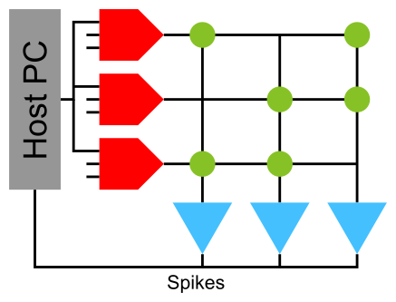
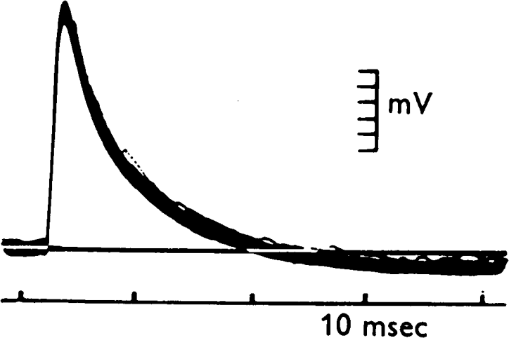
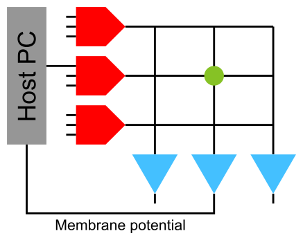
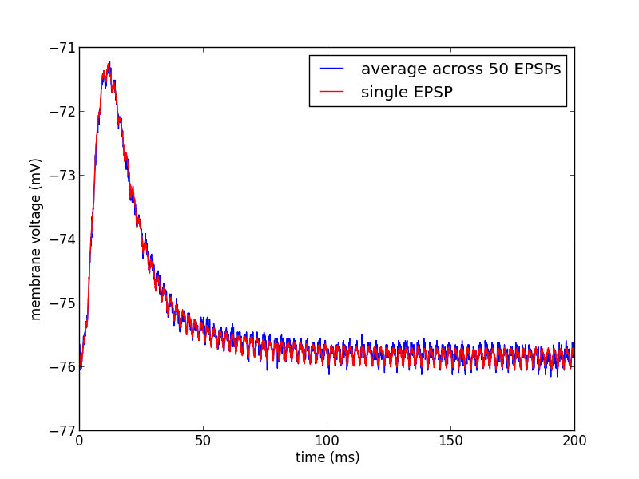
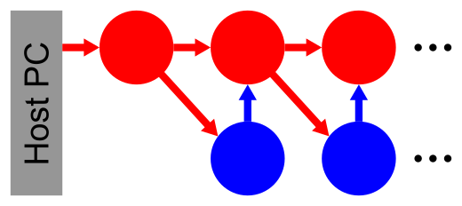
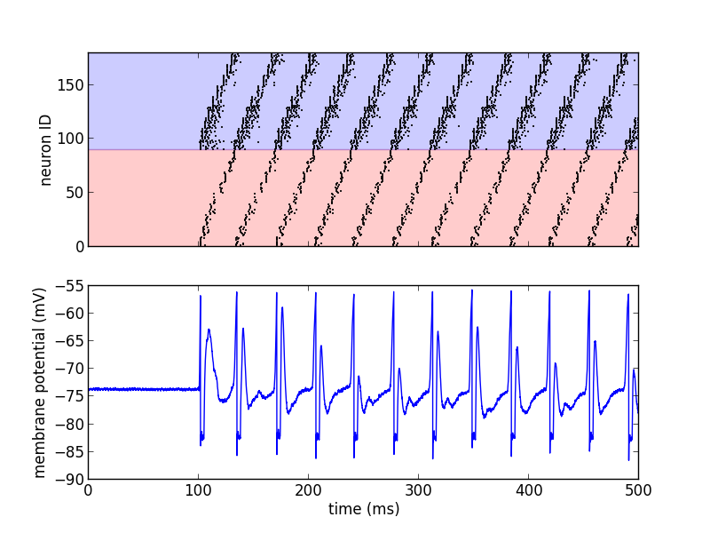
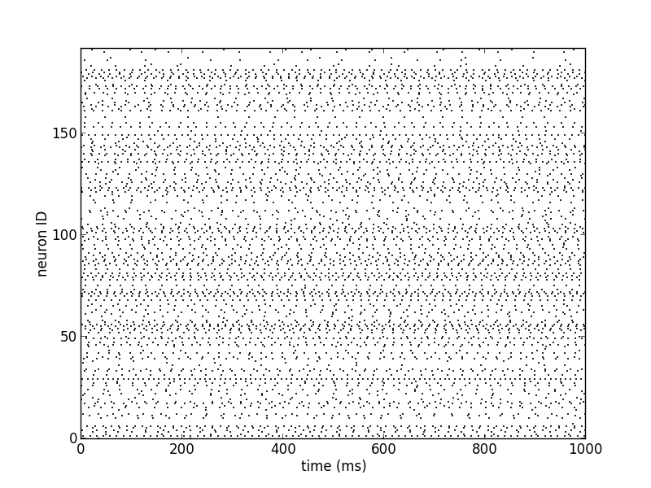
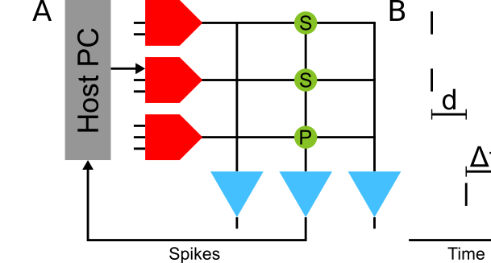

.. _label-spikeyschool:

Spikey school
=============

.. _label-intro:

Introduction to the hardware system
-----------------------------------

For an introduction to the Spikey neuromorphic system, its neuron and synapse models, its topology and its configuration space, see section 2 in [Pfeil2013]_.
Detailed information about the analog implementation of the neuron, STP and STDP models are given in Figure 17 in [Indiveri2011]_, [Schemmel2007]_ and [Schemmel2006]_, respectively.
The digital parts of the chip architecture are thoroughly documented in [Gruebl2007Phd]_.
The following paragraph will briefly summarize the features of the Spikey system.

.. figure:: spikey_system.png
    :align: center
    :alt: The Spikey system
    :width: 400px

    A photograph of the Spikey neuromorphic chip (a) and system (b), respectively.
    In (b) the Spikey chip is covered by a black seal.
    Adapted from [Pfeil2013]_.

The Spikey chip is fabricated in a 180nm CMOS process with die size :math:`5\,mm \times 5\,mm`.
While the communication to the host computer is mostly established by digital circuits, the spiking neural network is mostly implemented with analog circuits.
Compared to biological real-time, networks on the Spikey chip are accelerated, because time constants on the chip are approximately :math:`10^4` times smaller than in biology.
Each neuron and synapse has its physical implementation on the chip.
The total number of 384 neurons are split into two blocks of 192 neurons with 256 synapses each.
Each line of synapses in these blocks, i.e. 192 synapses, is driven by a *line driver*
that can be configured to receive input from external spike sources (e.g., generated on the host computer), from on-chip neurons in the same block or from on-chip neurons in the adjacent block.

.. figure:: spikey_topology.png
    :align: center
    :alt: Network topology
    :width: 400px

    Numbering of neurons (blue) and line drivers (red).
    Here, only connections within the same block of neurons are shown.
    For connections between the blocks see the following table.
    The weight of each synapse (green) can be configured with a 4-bit resolution, i.e., 16 different values.

.. TP: table directive does not work

Neuron assignment to line drivers:

==============  ====================  ===================== ==============  ====================  =====================
Line driver ID  Neuron ID left block  Neuron ID right block Line driver ID  Neuron ID left block  Neuron ID right block
==============  ====================  ===================== ==============  ====================  =====================
0               0                     193                    256             192                    1
1               1                     192                    257             193                    0
2               2                     195                    258             194                    3
3               3                     194                    259             195                    2
...             ...                   ...                    ...             ...                   ...
190             190                   383                    446             382                   191
191             191                   382                    447             383                   190
192             ext only              ext                    448             ext only              ext only only
...             ...                   ...                    ...             ...                   ...
255             ext only              ext                    511             ext only              ext only only
==============  ====================  ===================== ==============  ====================  =====================

The last (upper) 64 line drivers receive external inputs only and hence external spike sources line drivers are allocated from top to bottom.

The hardware implementations of neurons and synapses are inspired by the leaky integrate-and-fire neuron model using synapses with exponentially decaying or alpha-shaped conductances (PyNN neuron model ``IF_facets_hardware1``).
While the leak conductance (PyNN neuron model parameter ``g_leak``) and (absolute) refractory period (``tau_refrac``) is individually configurable for each neuron,
the resting (``v_rest``), reset (``v_reset``), threshold (``v_thresh``), excitatory reversal (clamped to ground) and inhibitory reversal potentials (``e_rev_I``) are shared among neurons (see [Pfeil2013]_ for details).
Line drivers generate the time course of postsynaptic conductances (PSCs) for a single row of synapses.
Among other parameters the rise time, fall time and amplitude of PSCs can be modulated for each line driver (for details see :ref:`label-lesson_1` and Figure 4.8 and 4.9 in [Petkov2012]_).
Each synapse stores a configurable 4-bit weight.
A synapse can be turned off, if its weight is set to zero.

During network emulations, spike times can be recorded from all neurons in parallel.
In contrast, membrane potential recordings are limited to a single, but arbitrary, neuron.

Network models for the Spikey hardware are described and controlled by PyNN (version 0.6; for an introduction to PyNN see :ref:`building_models`).
Due to the fact that PyNN is a Python package we recommend to have a look at a `Python tutorial <https://docs.python.org/2/tutorial/>`_.
For efficient data analysis and visualization with Python see tutorials for `Numpy <http://wiki.scipy.org/Tentative_NumPy_Tutorial>`_,
`Matplotlib <http://matplotlib.org/users/pyplot_tutorial.html>`_ and `Scipy <http://docs.scipy.org/doc/scipy/reference/tutorial/>`_.

.. _label-stp:

Short-term plasticity (STP)
^^^^^^^^^^^^^^^^^^^^^^^^^^^

Synaptic efficacy has been shown to change with presynaptic activity on the time scale of hundred milliseconds [ScholarpediaShortTermPlasticity]_.
The hardware implementation of such short-term plasticity is close to the model introduced by [Tsodyks1997]_.
However, on hardware STP can either be depressing or facilitating, but not mixtures of both as allowed by the original model.
For details about the hardware implementation and emulation results, see [Schemmel2007]_ and :ref:`label-lesson_4`, respectively.

.. _label-stdp:

Spike-timing dependent plasticity (STDP)
^^^^^^^^^^^^^^^^^^^^^^^^^^^^^^^^^^^^^^^^

Long-term (seconds to years) modification of synaptic weights has been shown to depend on the precise timing of spikes [ScholarpediaSTDP]_.
Weights are usually increased, if the postsynaptic neuron fires after the presynaptic one, and decreased for the opposite case.
Typically, synaptic weights change the more the smaller this temporal correlation is.
On hardware temporal correlations between pre- and postsynaptic neurons are measured and stored locally in each synapse.
Then a global mechanism sequentially evaluates these measurements and updates the synaptic weight according to a programmable look-up table.

.. _stdp-bio:

.. figure:: stdp_bio.png
    :align: center
    :alt: STDP in biology
    :width: 400px

    Spike-timing dependent plasticity measured in biological tissue (rat hippocampal neurons; adapted from [Bi2001]_).

.. figure:: stdp_schematic.png
    :align: center
    :alt: STDP implementation on Spikey
    :width: 400px

    Hardware implementation of STDP (adapted from [Pfeil2015Phd]_).

For a detailed description of the hardware implementation, measurements of single synapses and functional networks, see [Schemmel2006]_, [Pfeil2012STDP]_ and [Pfeil2013STDP]_, respectively.
Note that on hardware the reduced symmetric nearest neighbor spike pairing scheme is used (see Figure 7C in [Morrison2008]_).

Introduction to the lessons
---------------------------

Note that all emulation results shown in the following lessons were recorded from the Spikey chip 666 and may be different for other chips.
In particular, network, neuron and synapse parameters may have to be adjusted for proper network activity.
In the following we use ``pynn`` as an acronym for ``pyNN.hardware.stage1``.

.. _label-lesson_1:

Lesson 1: Exploring the parameter space
---------------------------------------

In this lesson, we explore the parameter space of neurons and synapses on the Spikey chip.

First, the parameters of neurons are investigated.
As an example, we measure the firing rate of a neuron in dependence on its leak conductance.
The neuron is stimulated by spikes from a Poisson process.

.. _rate-over-gleak-schematic:

    A neuron is stimulated using an external spike source and the spike times of the neuron are recorded.
    Synapses with weight zero are not drawn.

To average out fixed-pattern noise (see :ref:`label-lesson_2`) in both the synapse and neuron circuits, a population of neurons is stimulated by a population of spike sources.

.. _rate-over-gleak-results:

.. figure:: rate_over_gleak.png
    :align: center
    :alt: Rate over leak conductance
    :width: 400px

    The firing rate of the neuron in dependence on its leak conductance :math:`g_{leak}` (`source code lesson 1-1 <https://github.com/electronicvisions/spikey_demo/blob/master/networks/rate_over_gleak.py>`_).

By increasing the leak conductance of the neuron its membrane potential is pulled towards the resting potential and hence the firing rate of the neuron decreases.

**Tasks:**

* Measure and plot the dependency of the firing rate on other neuron parameters (for parameters, see :ref:`label-intro`).
  Interpret these dependencies qualitatively?

* Calibrate the firing rate of the neuron to a reasonable target rate by adjusting its leak conductance.

* Replace the input from a Poisson process (``pynn.SpikeSourcePoisson``) by a regular input with the same rate (tipp: use ``pynn.SpikeSourceArray``).
  What do you observe?

Second, synaptic parameters are investigated.
A neuron is stimulated with a single spike and its membrane potential is recorded.
To average out noise on the membrane potential (mostly caused by the readout process) we stimulate the neuron with a regular spike train
and calculate the spike-triggered average of these so-called excitatory postsynaptic potentials (EPSPs).

    Postsynaptic potentials measured in biological tissue (from motoneurons; adapted from [Coombs1955]_).

.. _epsp-schematic:

    A neuron is stimulated using a single synapse and its membrane potential is recorded.
    The parameters of synapses are adjusted row-wise in the line drivers (red).

.. _epsp-results:

    Single and averaged excitatory postsynaptic potentials (`source code lesson 1-2 <https://github.com/electronicvisions/spikey_demo/blob/master/networks/epsp.py>`_).

**Tasks:**

* Vary the parameters ``drvifall`` and ``drviout`` of the synapse line drivers and investigate their effect on the shape of EPSPs
  (tipp: use ``pynn.Projection.setDrvifallFactors`` and ``pynn.Projection.setDrvioutFactors`` to scale these parameters, respectively).

* Compare the EPSPs between excitatory to inhibitory synapses.

* Compare the shape of the first EPSPs.
  They may differ due to the initial loading of capacities (e.g. wires).
  Discard an appropriate number of EPSPs at the beginning of the emulation to avoid these distortions.

.. commenting out a todo:: regarding noise refer to Eric's publication

.. _label-lesson_2:

Lesson 2: Fixed-pattern and temporal noise:
-------------------------------------------

In this lesson, we investigate fixed-pattern and temporal noise in the analog neuron and synapse circuits of the Spikey hardware system.

In contrast to simulations with software, emulations on analog neuromorphic hardware are subject to noise.
We distinguish between fixed-pattern and temporal noise.
Fixed-pattern noise are variations of neuron and synapse parameters across the chip due to imperfections in the production process.
Calibration can reduce this noise, because it is approximately constant over time.
In contrast, temporal noise, including electronic noise and temperature fluctuations, causes different results in consecutive emulations of identical networks.

**Tasks:**

* Investigate the fixed-pattern noise across neurons:
  Record the firing rates of several neurons for the default value of the leak conductance (see Figure :num:`rate-over-gleak-schematic` and :num:`rate-over-gleak-results`; tipp: record all neurons at once).
  Interpret the distribution of these firing rates by plotting a histogram and calculating the variance.

* Investigate the fixed-pattern noise across synapses:
  For a single neuron, vary the row of the stimulating synapse and calculate the variance of the area under the EPSPs across synapses (see Figure :num:`epsp-schematic` and :num:`epsp-results`).

* Estimate the ratio between fixed-pattern and temporal noise:
  Measure the reproducibility of emulations, i.e., the error of firing rates across identical consecutive trials.
  Use the network and parameters from the first task and measure this error for each neuron.
  Compare the variance of the firing rates across trials (averaged across neurons) to that one across neurons in a single trial.
  Extra: How does the reproducibility depend on the duration of emulations and the number of consecutive trials?

Lesson 3: Feedforward networks
------------------------------

In this lesson, we learn how to setup networks on the Spikey system.
In the last lessons neurons received their input exclusively from external spike sources.
Now, we introduce connections between hardware neurons.
As an example, a synfire chain with feedforward inhibition is implemented (for details, see [Pfeil2013]_).
Populations of neurons represent the links in this chain and are unidirectionally interconnected.
After stimulating the first neuron population, network activity propagates along the chain, whereby neurons of the same population fire synchronously.

    Schematic of a synfire chain with feedforward inhibition.
    Excitatory and inhibitory neurons are coloured red and blue, respectively.

In PyNN connections between hardware neurons can be treated like connections from external spike sources to hardware neurons.
Note that synaptic weights on hardware can be configured with integer values in the range [0..15].
To stay within the range of synaptic weights supported by the hardware, it is useful to specify weights in the domain of these integer values and translate them into biological parameter domain by multiplying them with ``pynn.minExcWeight()`` or ``pynn.minInhWeight()`` for excitatory and inhibitory connections, respectively.
Synaptic weights that are not multiples of ``pynn.minExcWeight()`` and ``pynn.minInhWeight()`` for excitatory and inhibitory synapses, respectively, are stochastically rounded to integer values.

    Emulated network activity of the synfire chain including the membrane potential of the neuron with ID=0 (`source code lesson 3 <https://github.com/electronicvisions/spikey_demo/blob/master/networks/synfire_chain.py>`_).
    The same color code as in the schematic is used.

**Tasks:**

* Adjust the synaptic weights to obtain a loop of network activity that lasts for at least 1000 seconds.

* Reduce the number of neurons in each population and maximize the period of network activity.
  Which hardware feature limits the minimal number of neurons in each population?

* Open the loop and increase the number of neurons in each population to obtain a stable propagation of network activity.
  Systematically vary the initial stimulus (number of spikes and standard deviation of their timing) to investigate the filter properties of this network (for orientation, see [Kremkow2010]_ and [Pfeil2013]_).

Lesson 4: Recurrent networks
----------------------------

In this lesson, a recurrent network of neurons with sparse and random connections is investigated.
To avoid self-reinforcing network activity that may arise from excitatory connections, we choose connections between neurons to be inhibitory with weight :math:`w`.
Each neuron is configured to have a fixed number :math:`K` of presynaptic partners that are randomly drawn from all hardware neurons (for details, see [Pfeil2015]_).
Neurons are stimulated by a constant current that drives the neuron above threshold in the absence of external input.
Technically this current is implemented by setting the resting potential above the firing threshold of the neuron.
The absence of external stimulation cancels the transfer of spikes to the system and accelerates the experiment execution.
In addition, once configured this recurrent network runs hypothetically forever.

    Schematic of the recurrent network.
    Neurons within a population of inhibitory neurons are randomly and sparsely connected to each other.

    Network activity of a recurrent network with :math:`K=15` (`source code lesson 4 <https://github.com/electronicvisions/spikey_demo/blob/master/networks/decorr_network.py>`_).

**Tasks:**

* For each neuron, measure the firing rate and plot it against the coefficient of variation (CVs) of inter-spike intervals.
  Interpret the correlation between firing rates and CVs.

* Measure the dependence of the firing rates and CVs on :math:`w` and :math:`K`.
  Calibrate the network towards a firing rate of approximately :math:`25 \frac{1}{s}`.
  Extra: And maximize the average CV.

* Extra: Calculate the pair-wise correlation between randomly drawn spike trains of different neurons in the network (consider using `<http://neuralensemble.org/elephant/>`_ to calculate the correlation).
  Investigate the dependence of the average correlation on :math:`w` and :math:`K` (tipp: use 100 pairs of neurons to calculate the average).
  Use these results to minimize correlations in the activity of the network.

.. _label-lesson_4:

Lesson 5: Short-term plasticity
-------------------------------

In this lesson, the hardware implementation of :ref:`label-stp` is investigated.
The network description is similar to that shown in Figure :num:`epsp-schematic`, but with STP enabled in the synapse line driver.

.. figure:: stp_bio.png
    :align: center
    :alt: STP in biology
    :width: 400px

    Depressing STP measured in biological tissue (adapted from [Tsodyks1997]_).

.. figure:: stp.png
    :align: center
    :alt: STP on hardware
    :width: 400px

    Depressing STP on the Spikey neuromorphic system (`source code lesson 5 <https://github.com/electronicvisions/spikey_demo/blob/master/networks/stp.py>`_).

The weight of the synapse decreases with each presynaptic spike and recovers after the absence of presynaptic input.

**Tasks:**

* Compare the membrane potential to a network with STP disabled.

* Configure STP to be facilitating.

Lesson 6: Long-term plasticity
------------------------------

In this lesson, we investigate :ref:`label-stdp` on hardware.
An external input is connected to the postsynaptic neuron and STDP is enabled for this plastic synapse (P).
To adjust the timing between pre- and postsynaptic spikes, several external inputs with static synaptic weights (S) are used to elicit a spike in the postsynaptic neuron.
By measuring :math:`d`, the timing between the pre- and postsynaptic spike :math:`\Delta t` can be adjusted on the host computer (see spike timing in Figure :num:`stdp-schematic` B).

.. _stdp-schematic:

    Network configuration (A) and spike timing (B) to measure STDP on the Spikey chip (`source code lesson 6 <https://github.com/electronicvisions/spikey_demo/blob/master/networks/stdp.py>`_).

This network can be used to measure the dependency of synaptic changes :math:`\Delta w` on the timing :math:`\Delta t` (cf. Figure :num:`stdp-bio`).
The inverse of the number :math:`N` of spike pairs that are required to elicit a weight update represent the change of the synaptic weight.

**Tasks:**

* Configure the hardware neurons and synapses such that each volley of presynaptic spikes evokes exactly a single postsynaptic spike.
  Due to the intrinsic adaptation of hardware neurons consider discarding the first few spike pairs for the plastic synapse.

* Plot :math:`\frac{1}{N}` over :math:`\Delta t` and compare your results to Figure :num:`stdp-bio`.

* Extra: Investigate the results of the last task for varying rows and columns of synapses.

Lesson 7: Functional networks
-----------------------------

* `A Neuromorphic Network for Generic Multivariate Data Classification <https://github.com/Huitzilo/neuromorphic_classifier>`_

Other network examples
----------------------

* `Simple synfire chain <https://github.com/electronicvisions/hbp_platform_demo/tree/master/spikey>`_

.. commenting out todo:: add example demonstrating that recording spikes is much faster than recording membrane potentials

References
----------

.. [Bi2001] Bi et al. (2001). `Synaptic modification by correlated activity: Hebb’s postulate revisited <http://www.annualreviews.org/doi/pdf/10.1146/annurev.neuro.24.1.139>`_. Annu. Rev. Neurosci. 24, 139–66.
.. [Coombs1955] Coombs et al. (1955). `Excitatory synaptic action in motoneurones <http://onlinelibrary.wiley.com/doi/10.1113/jphysiol.1955.sp005413/pdf>`_. The Journal of Physiology 130 (2), 374–395.
.. [Gruebl2007Phd] Grübl, A. (2007). `VLSI Implementation of a Spiking Neural Network <http://www.kip.uni-heidelberg.de/Veroeffentlichungen/download.php/4630/ps/agruebl_diss_kip.pdf>`_. PhD thesis, Heidelberg University. HD-KIP 07-10.
.. [Indiveri2011] Indiveri et al. (2011). `Neuromorphic silicon neuron circuits <http://journal.frontiersin.org/article/10.3389/fnins.2011.00073/pdf>`_. Front. Neurosci. 5 (73).
.. [Kremkow2010] Kremkow et al. (2010). `Gating of signal propagation in spiking neural networks by balanced and correlated excitation and inhibition <http://www.jneurosci.org/content/30/47/15760.short>`_. J. Neurosci. 30 (47), 15760–15768.
.. [Morrison2008] Morrison et al. (2008). `Phenomenological models of synaptic plasticity based on spike-timing <http://link.springer.com/content/pdf/10.1007%2Fs00422-008-0233-1.pdf>`_. Biol. Cybern. 98, 459–478.
.. [Petkov2012] Petkov, V. (2012). `Toward Belief Propagation on Neuromorphic Hardware <http://www.kip.uni-heidelberg.de/Veroeffentlichungen/download.php/5150/temp/2635-1.pdf>`_. Diploma thesis, Heidelberg University. HD-KIP 12-23.
.. [Pfeil2012STDP] Pfeil et al. (2012). `Is a 4-bit synaptic weight resolution enough? – constraints on enabling spike-timing dependent plasticity in neuromorphic hardware <http://arxiv.org/pdf/1201.6255>`_. Front. Neurosci. 6:90.
.. [Pfeil2013] Pfeil et al. (2013). `Six networks on a universal neuromorphic computing substrate <http://arxiv.org/pdf/1210.7083>`_. Front. Neurosci. 7 (11).
.. [Pfeil2013STDP] Pfeil et al. (2013). `Neuromorphic learning towards nano second precision <http://arxiv.org/pdf/1309.4283>`_. In Neural Networks (IJCNN), The 2013 International Joint Conference on, pp. 1–5. IEEE Press.  
.. [Pfeil2015] Pfeil et al. (2013). `The effect of heterogeneity on decorrelation mechanisms in spiking neural networks: a neuromorphic-hardware study <http://arxiv.org/pdf/1411.7916>`_. Submitted.
.. [Pfeil2015Phd] Pfeil (2015). `Exploring the potential of brain-inspired computing <http://archiv.ub.uni-heidelberg.de/volltextserver/18258/1/tpfeil_phd_thesis_2014_v5.pdf>`_. Doctoral thesis, Heidelberg University.
.. [Schemmel2007] Schemmel et al. (2007). `Modeling synaptic plasticity within networks of highly accelerated I&F neurons <http://www.kip.uni-heidelberg.de/Veroeffentlichungen/download.php/4799/ps/schemmel_iscas2007_spikey.pdf>`_. In Proceedings of the 2007 International Symposium on Circuits and Systems (ISCAS), New Orleans, pp. 3367–3370. IEEE Press.
.. [Schemmel2006] Schemmel et al. (2006). `Implementing synaptic plasticity in a VLSI spiking neural network model <http://www.kip.uni-heidelberg.de/Veroeffentlichungen/download.php/4620/ps/1774.pdf>`_. In Proceedings of the 2006 International Joint Conference on Neural Networks (IJCNN), Vancouver, pp. 1–6. IEEE Press.
.. [ScholarpediaShortTermPlasticity] Misha Tsodyks and Si Wu (2013) `Short-term synaptic plasticity <http://www.scholarpedia.org/article/Short-term_plasticity>`_. Scholarpedia, 8(10):3153.
.. [ScholarpediaSTDP] Jesper Sjöström and Wulfram Gerstner (2010) `Spike-timing dependent plasticity <http://www.scholarpedia.org/article/Spike-timing_dependent_plasticity>`_. Scholarpedia, 5(2):1362.
.. [Tsodyks1997] Tsodyks et al. (1997). `The neural code between neocortical pyramidal neurons depends on neurotransmitter release probability <http://www.pnas.org/content/94/2/719.full.pdf>`_. Proc. Natl. Acad. Sci. USA 94, 719–723.
