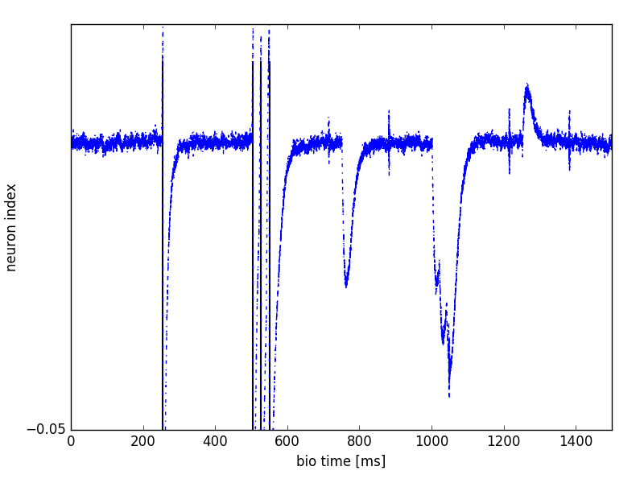
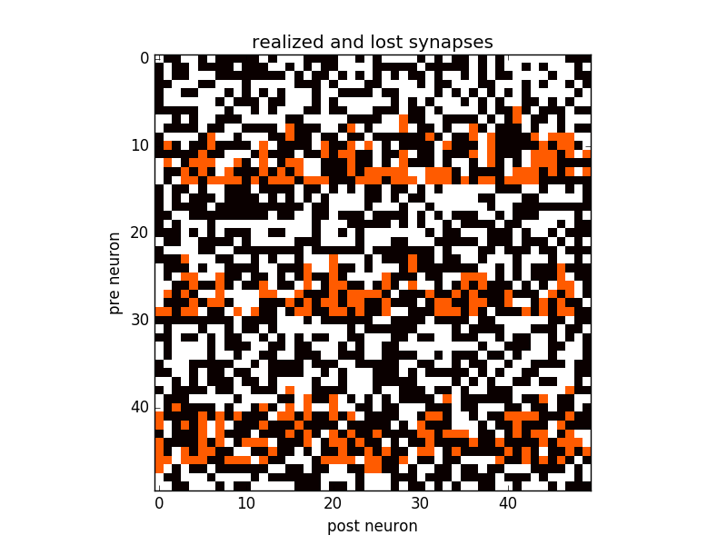

============================
Using the BrainScaleS system
============================

As explained in :ref:`building_models`, both the experiment description and the model description
for the BrainScaleS system must be written as Python scripts,
using the PyNN application programming interface (API), version 0.7.

In the following, the build and work flow on UHEI BrainScaleS cluster frontend nodes is described.
If BrainScaleS is accessed through the Collaboratory or the Python client, the installation can be skipped.

Setup
------------

.. code-block:: bash

	export LC_ALL=C
	module load nmpm_software/current

.. code-block:: bash

    python -c "import pyhmf" && echo ok

should print ``ok``.

The translation from the `biological` neuronal network description into a `hardware` configuration
is performed by the ``marocco`` mapping tool
(for more detailed information, see :ref:`details_software_stack` below).

The BrainScaleS system attempts to automatically place neurons on the wafers in an optimal way.
However, it is possible to influence this placement, control it manually, and examine the resultant
data structures using the Python helper module :py:mod:`pymarocco`.
This enables users to go from a property in PyNN (e.g. the refractory period of a single neuron
within an assembly) to the corresponding parameter on hardware.
A typical use case is iterative low-level tuning of hardware parameters.

.. _label-marocco-example:

Using marocco
-------------

.. code-block:: python

    import pyhmf as pynn
    from pymarocco import PyMarocco

    marocco = PyMarocco()
    pynn.setup(marocco=marocco)

Make sure that the call to :py:func:`setup()` happens before creating
populations, if not, the populations will not be visible to ``marocco``.

In the following example, one neuron is placed on the wafer, however,
by setting ``marocco.backend = PyMarocco.None``, the software stops after the map & route process
(i.e. before configuring the hardware system).

.. code-block:: python

    import pyhmf as pynn
    from pymarocco import PyMarocco

    marocco = PyMarocco()
    marocco.backend = PyMarocco.None

    pynn.setup(marocco=marocco)

    neuron = pynn.Population(1, pynn.IF_cond_exp, {})

    pynn.run(10)
    pynn.end()

.. note:: Available ``marocco`` backends are ``None``, ``Hardware``, ``ESS``. None has been described above.
          Hardware is the default and performs real experiment runs on the neuromorphic hardware system.
          ESS runs a simulation of the hardware: the Executable System Specification.

In the output you should see:

.. code-block:: bash

        Populations:
                0th element:    0x1f98650       Population(IF_cond_exp, 1)

If you don't see this output, make sure that you called
``pynn.setup(marocco=marocco)`` before the call to ``pynn.Population``.

You will also see a lot of debugging output. To set the log level, add

.. code-block:: python

    import pylogging
    for domain in [""]:
        pylogging.set_loglevel(pylogging.get(domain), pylogging.LogLevel.ERROR)

after the import of :py:mod:`pymarocco`.

As we did not specify on which chip the neuron should be placed,
marocco decides automatically to use ``HICANNOnWafer(X(18), Y(7)),
Wafer(0)`` which is in the center of the wafer.

To choose the HICANN a population is placed on, we give marocco a hint:

.. code-block:: python

		import Coordinate as C

		marocco.manual_placement.on_hicann(neuron, C.HICANNOnWafer(C.X(5), C.Y(5)))

At the end, the script is the following:

.. literalinclude:: examples/sw/nmpm1_marocco_intro.py

We also added a print out of the chosen neuron circuits:

.. code-block:: bash

		NeuronOnWafer(NeuronOnHICANN(X(0), top), HICANNOnWafer(X(5), Y(5)))
		NeuronOnWafer(NeuronOnHICANN(X(1), top), HICANNOnWafer(X(5), Y(5)))
		NeuronOnWafer(NeuronOnHICANN(X(0), bottom), HICANNOnWafer(X(5), Y(5)))
		NeuronOnWafer(NeuronOnHICANN(X(1), bottom), HICANNOnWafer(X(5), Y(5)))

Calibration
'''''''''''

To change the calibration backend from database to XML set
"calib_backend" to XML. Then the calibration is looked up in xml files
named ``w0-h84.xml``, ``w0-h276.xml``, etc. in the directory
"calib_path".

.. _label-marocco-example:

Running pyNN scripts
''''''''''''''''''''

To run on the *hardware* one needs to use the slurm job queue system:

.. code-block:: bash

	srun -p experiment --wmod 33 --hicann 297 python nmpm1_single_neuron.py

nmpm1_single_neuron.py:

.. literalinclude:: examples/hw/nmpm1_single_neuron.py

Currently, the calibration is optimized towards the neuron parameters of the example.
Also note that current parameters, i.e. ``i_offset`` are not supported.

With the help of ``plot_spikes.py``, the recorded spikes (``spikes_w15.txt``) and
membrane trace (``membrane_w15.txt``) for the digital weight setting 15 can be plotted.

Inspect the synapse loss
------------------------

When mapping network models to the wafer-scale hardware, it may happen that not
all model synapses can be realized on the hardware due to limited hardware
resources. Below is a simple network that is mapped to very limited resources
so that synapse loss is enforced. For this example we show how to extract
overall mapping statistics and projection-wise or synapse-wise synapse losses.

.. literalinclude:: examples/sw/synapse_loss.py
   :pyobject: main

Where ``print marocco.stats`` prints out overall synapse loss statistics:

.. code-block:: bash

    MappingStats {
            synapse_loss: 581 (23.3709%)
            synapses: 2486
            synapses set: 1905
            synapses lost: 581
            synapses lost(l1): 0
            populations: 2
            projections: 2
            neurons: 50}

Invidual mapping statistics like the number of synapses set can also be
directly accessed in python, see class ``MappingStats`` in the
`marocco documentation`_.

The function ``projectionwise_synapse_loss`` shows how to calculate the synapse
loss per projection.

.. literalinclude:: examples/sw/synapse_loss.py
   :pyobject: projectionwise_synapse_loss

Which yields the following output for the example above:

.. code-block:: bash

    Projection-Wise Synapse Loss Projection ( PyAssembly (50) -> PyAssembly (50)) 23.5576923077
    Projection-Wise Synapse Loss Projection ( PyAssembly (50) -> PyAssembly (50)) 23.182552504

Finally, the function ``plot_projectionwise_synapse_loss`` can be used to plot
the lost and realized synapses of one projection.

.. literalinclude:: examples/sw/synapse_loss.py
   :pyobject: plot_projectionwise_synapse_loss

   Realized (black) and lost (red) synapses of the stimulus projection in the
   example network above.

.. _details_software_stack:

Details of the software stack
-----------------------------

The BrainScaleS Wafer-Scale Software Stack is shown in Figure :num:`waferscale-software-figure`.

User-provided neuronal network topologies  are evaluated by our ``PyNN`` API implementation (``PyHMF``),
which is written in C++ with a Python wrapper.
The data structures (spike trains, populations, projections, cell types, meta information, etc.) are implemented in C++ (``euter``).
This layer also provides a serialization and deserialization interface for lower software layers.
In a nutshell, ``euter`` serializes the ``PyNN``/``PyHMF``-based experiment description into a binary data stream and hands over to the next software layer.
In the following software layers, the translation from this `biological` neuronal network description into a `hardware` configuration will be performed.
A large fraction of the translation work, in particular the network graph translation, is performed by the ``marocco`` mapping tool
(described in the `PhD thesis of S. Jeltsch <http://www.kip.uni-heidelberg.de/Veroeffentlichungen/details.php?id=3052>`_.
Code documentation is provided by ``doxygen`` and available
`here <https://brainscales-r.kip.uni-heidelberg.de:8443/view/doc/job/doc-dsl_marocco/marocco_Documentation>`_.

.. _waferscale-software-figure:

.. figure:: software_as_pipeline.png
      :width: 100%
      :alt: The BrainScaleS System Software Stack

      Data-flow-centric view of the user software stack of the BrainScaleS Wafer-Scale System.
      [taken from `PhD thesis of E. Müller <http://www.kip.uni-heidelberg.de/Veroeffentlichungen/details.php?id=3112>`_]

``marocco`` uses calibration (``calibtic``) and blacklisting (``redman``) information to take into account circuit-specific properties and defects.
This information is needed during the map & route process to homogenize the behavior of hardware neuron and synapse circuits and to exclude defective parts of the system.

.. _`marocco documentation`: https://brainscales-r.kip.uni-heidelberg.de:8443/view/doc/job/doc-dsl_marocco/marocco_Documentation
