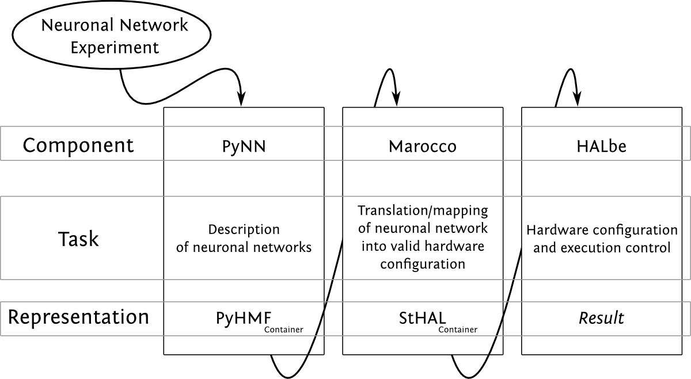
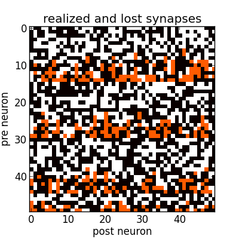

=================================
Mapping to the Wafer-Scale System
=================================

The translation of neuronal network descriptions to corresponding hardware configurations is performed by the BrainScaleS Wafer-Scale Software Stack.
User-provided neuronal network topologies  are evaluated by our ``PyNN`` API implemented (``PyHMF``).
The data structures (spike trains, populations, projections, cell types, meta information, etc.) are implemented in C++ (``euter``).
This layer also provides a serialization and deserialization interface for lower software layers.
In a nutshell, ``euter`` serializes the ``PyNN``/``PyHMF``-based experiment description into a binary data stream and hands over to the next software layer.
In the following software layers, the translation from this `biological` neuronal network description into a `hardware` configuration will be performed.
A large fraction of the translation work, in particular the network graph translation, is performed by the ``marocco`` mapping tool
(described in the `PhD thesis of S. Jeltsch <http://www.kip.uni-heidelberg.de/Veroeffentlichungen/details.php?id=3052>`_.
Code documentation is provided by ``doxygen`` and available
`here <https://brainscales-r.kip.uni-heidelberg.de:8443/view/doc/job/doc-dsl_marocco/marocco_Documentation>`_.

.. _BrainScaleS-System-Software-Stack:

      Data-flow-centric view of the user software stack of the BrainScaleS Wafer-Scale System.
      [taken from `PhD thesis of E. Müller <http://www.kip.uni-heidelberg.de/Veroeffentlichungen/details.php?id=3112>`_]

``marocco`` uses calibration (``calibtic``) and blacklisting (``redman``) information to take into account circuit-specific properties and defects.
This information is needed during the map & route process to homogenize the behavior of hardware neuron and synapse circuits and to exclude defective parts of the system.

``marocco`` also provides interfaces to access the result data structure;
this enables users to go from a property in ``PyNN`` (e.g. the refractory period of a single neuron within an assembly) to the corresponding parameter on hardware.
A typical use case is iterative low-level tuning of hardware parameters.

In the following the build and work flow on UHEI cluster frontend nodes is described.
This is only needed if you want to use the system locally.
If the BrainScaleS System is accessed through the HBP Collaboratory or the Python client, a pre-installed software environment is provided.

Installation
------------

Create and change to a directory for your projects, preferably on ``wang``, e.g.: ``/wang/users/<somebody>/cluster_home/projects``.

ssh-agent
'''''''''

To reduce the amount of typing, please consider using ``ssh-agent`` to cache your key password:

.. code-block:: bash

    eval `ssh-agent`
    ssh-add ~/path/to/your/private_id_rsa

Build Tool
''''''''''

We use a custom version (``git@gitviz.kip.uni-heidelberg.de:waf.git``) of the ``waf`` configuration and build tool.
A nightly version is provided by loading:

.. code-block:: bash

    module load waf

PyHMF, marocco and Dependencies
'''''''''''''''''''''''''''''''

The first step is to create a new workspace for the software checkouts and the subsequent build

.. code-block:: bash

    mkdir ~/my_nmpm_software && cd ~/my_nmpm_software

Now ``waf`` can be used to setup the project.
It will clone all the dependencies.

.. code-block:: bash

    waf setup --project pyhmf --project=marocco --without-ester

The next step is configuration.
As the default software environment on the UHEI cluster does not provide all the software dependencies, you have to load some modules which will provide those dependencies:

.. code-block:: bash

    module load localdir
    module load pynn/0.7.5
    module load mongo
    module load yaml-cpp/0.5.3

As those commands are needed every time you want to use the software it is convenient to put all the needed parts into a script:

.. code-block:: bash

    echo "INSTALLED_LIB_PATH=$(readlink -e lib)" > init.sh
    cat >>init.sh<<EOF
    cd ${INSTALLED_LIB_PATH}
    module load localdir
    module load pynn/0.7.5
    module load mongo
    module load yaml-cpp/0.5.3
    cd -
    EOF

After completing the installation steps below, this script can be sourced (``source init.sh``) to access the BrainScaleS Wafer-Scale Software Stack.

Now the configuration step:

.. code-block:: bash

    waf configure

The install step will build and install all targets into subdirectories of your current working directory.
Currently, you need to explicitly specify some extra targets in a second call.

.. code-block:: bash

    waf install --test-execnone
    # some extra targets are needed
    waf install --target=pymarocco,pyhalbe,pysthal,redman_xml --test-execnone

If you want to include the calibration toolkit (``cake``) (optional):

.. code-block:: bash

    waf setup --project pyhmf --project marocco --project cake --without-ester
    # module load ...
    waf configure
    waf install --test-execnone
    # some extra targets are needed
    waf install --target=pymarocco,pyhalbe,pysthal,redman_xml,pycake --test-execnone

To include support for executable system simulation (ESS) add ``--with-ess`` to the setup call.

Please remember, to that you have to setup the software environment if you start new shells (e.g. by using the  ``init.sh`` script):

.. code-block:: bash

    source ~/my_nmpm_software/init.sh

Check if the installation and the setup of variables is fine:

.. code-block:: bash

    python -c "import pyhmf" && echo ok

should print ``ok``, if instead:

.. code-block:: python

    Traceback (most recent call last):
      File "<string>", line 1, in <module>
    ImportError: No module named pyhmf

occurs, either the installation failed or the environment variables responsible for finding the module are wrong.
In that case, double check if you followed the instructions 1:1.

Usage
-----

``PyHMF`` is the C++ implementation of ``PyNN`` for the BrainScaleS Wafer-Scale System.
To allow you to change the simulation/emulation backend easily, it is advised to give the ``pyhmf`` module an other name like ``pynn``:

.. code-block:: python

    #import pynn.nest as pynn # if you want to use nest
    import pyhmf as pynn # if you want to use the BrainScaleS Wafer-Scale System

The helper module ``pymarocco`` provides access to mapping-specific settings and mapping result data:

.. code-block:: python

		import pyhmf as pynn
		from pymarocco import PyMarocco

		marocco = PyMarocco()
		pynn.setup(marocco = marocco)

Make sure that the call to ``pynn.setup`` happens before creating
populations, if not, the populations will not be visible to ``marocco``.
Now it is time to start the software stack:

.. code-block:: bash

	python main.py

If ``pyNN.recording.files`` cannot be imported, ``PyNN`` is missing from your paths:

.. code-block:: python

	Traceback (most recent call last):
	  File "main.py", line 5, in <module>
		import pyhmf as pynn
	ImportError: No module named pyNN.recording.files

You can add ``PyNN`` to your paths by loading the module:

.. code-block:: bash

	module load pynn/0.7.5

In the following example, one neuron is placed on the wafer, however,
by choosing the backend ``None``, the software stops after the map & route process (i.e. before configuring the hardware system).

Available backends: None, Hardware, ESS. None has been described above.
Hardware is the default and performs real experiment runs on the neuromorphic hardware system.
ESS runs a simulation of the hardware: the Executable System Specification.

.. code-block:: python

		import pyhmf as pynn
		from pymarocco import PyMarocco

		marocco = PyMarocco()
		marocco.backend = PyMarocco.None

		pynn.setup(marocco = marocco)

		neuron = pynn.Population(1, pynn.IF_cond_exp)

		pynn.run(10)
		pynn.end()

In the output you should see:

.. code-block:: bash

		Populations:
                0th element:    0x1f98650       Population(IF_cond_exp, 1)

If you don't see this output, make sure that you called
``pynn.setup(marocco = marocco)`` before the call to
``pynn.Population``.

You will also see a lot of debug output. To set the log level, add

.. code-block:: python

   import pylogging
   for domain in [""]:
	pylogging.set_loglevel(pylogging.get(domain), pylogging.LogLevel.ERROR)

after the line importing ``PyMarocco`` to your script.

As we did not specify on which chip the neuron should be placed,
marocco decides automatically to use ``HICANNOnWafer(X(18), Y(7)),
Wafer(0)`` which is in the center of the wafer.

To choose the HICANN a population is placed on, we give marocco a hint:

.. code-block:: python

		import Coordinate as C

		marocco.manual_placement.on_hicann(neuron, C.HICANNOnWafer(C.X(5), C.Y(5)))

At the end, the script is the following:

nmpm1_marocco_intro.py:

.. literalinclude:: examples/nmpm1_marocco_intro.py

We also added a print out of the chosen neuron circuits:

.. code-block:: bash

		NeuronOnWafer(NeuronOnHICANN(X(0), top), HICANNOnWafer(X(5), Y(5)))
		NeuronOnWafer(NeuronOnHICANN(X(1), top), HICANNOnWafer(X(5), Y(5)))
		NeuronOnWafer(NeuronOnHICANN(X(0), bottom), HICANNOnWafer(X(5), Y(5)))
		NeuronOnWafer(NeuronOnHICANN(X(1), bottom), HICANNOnWafer(X(5), Y(5)))

Calibration
'''''''''''

To change the calibration backend from database to XML set
"calib_backend" to XML. Then the calibration is looked up in xml files
named ``w0-h84.xml``, ``w0-h276.xml``, etc. in the directory
"calib_path".

.. _label-marocco-example:

Running pyNN scripts
''''''''''''''''''''

To run on the *hardware* one needs to use the slurm job queue system:

.. code-block:: bash

	srun -p wafer python nmpm1_single_neuron.py

nmpm1_single_neuron.py:

.. literalinclude:: examples/nmpm1_single_neuron.py

Inspect the Configuration
'''''''''''''''''''''''''

.. code-block:: bash

    sthal/tools/dump_cfg.py

Inspect the synapse loss
------------------------

When mapping network models to the wafer-scale hardware, it may happen that not
all model synapses can be realized on the hardware due to limited hardware
resources. Below is a simple network that is mapped to very limited resources
so that synapse loss is enforced. For this example we show how to extract
overall mapping statistics and projection-wise or synapse-wise synapse losses.

.. literalinclude:: examples/synapse_loss.py
   :pyobject: main

Where ``print marocco.stats`` prints out overall synapse loss statistics:

.. code-block:: bash

    MappingStats {
            synapse_loss: 581 (23.3709%)
            synapses: 2486
            synapses set: 1905
            synapses lost: 581
            synapses lost(l1): 0
            populations: 2
            projections: 2
            neurons: 50}

Invidual mapping statistics like the number of synapses set can also be
directly accessed in python, see class ``MappingStats`` in
`documentation-marocco`_.

The function ``projectionwise_synapse_loss`` shows how to calculate the synapse
loss per projection.

.. literalinclude:: examples/synapse_loss.py
   :pyobject: projectionwise_synapse_loss

Which yields the following oubput for the example above:

.. code-block:: bash

    Projection-Wise Synapse Loss Projection ( PyAssembly (50) -> PyAssembly (50)) 23.5576923077
    Projection-Wise Synapse Loss Projection ( PyAssembly (50) -> PyAssembly (50)) 23.182552504

Finally, the function ``plot_projectionwise_synapse_loss`` can be used to plot
the lost and realized synapses of one projection.

.. literalinclude:: examples/synapse_loss.py
   :pyobject: plot_projectionwise_synapse_loss

   Realized (black) and lost (red) synapses of the stimulus projection in the
   example network above.
