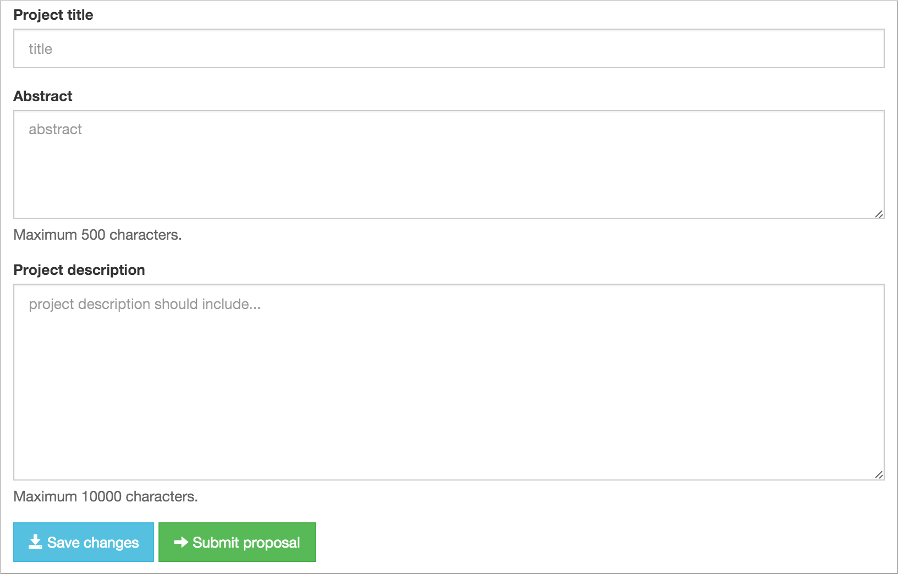
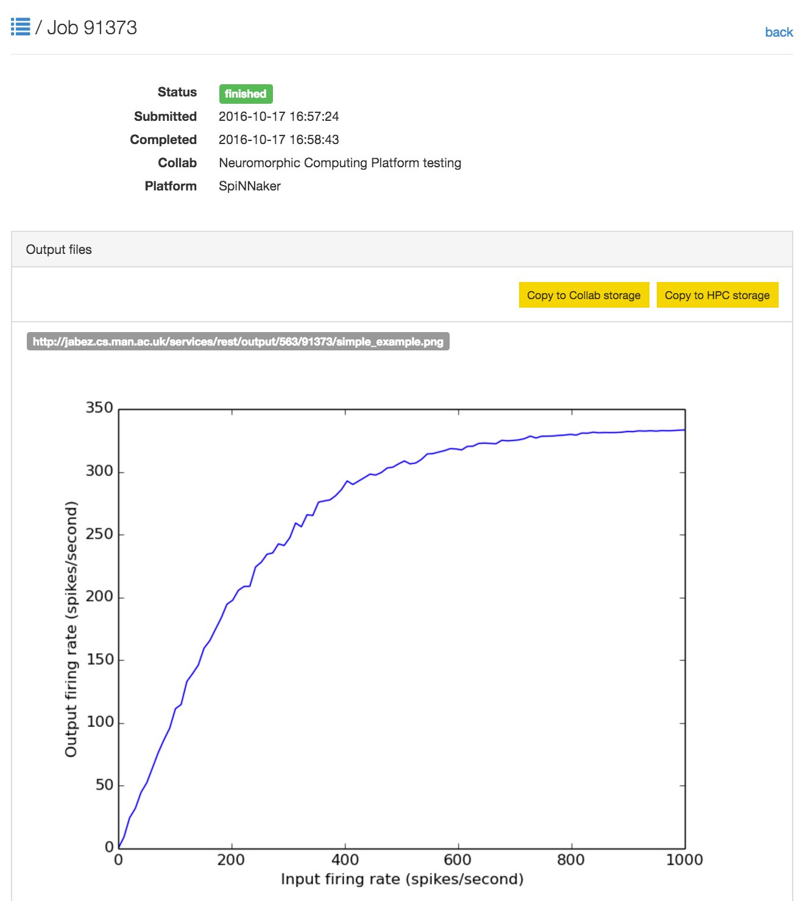

.. _quick_start:

===============
Getting started
===============

To use the HBP Neuromorphic Computing Platform you will need:

1. an HBP Identity account (`available on request`_)
2. to sign the `Platform User Agreement`_ and return it to neuromorphic@humanbrainproject.eu

Once you've received confirmation that access has been approved, head to the `Platform home page`_
and click on "Get started!"

This will create a new "collab" (a collaborative workspace) within the HBP Collaboratory_,
pre-loaded with the tools you will need to access the Platform. You can now:

* Add team members to your Collab using the ":guilabel:`Team`" link in the navigation bar on the left.
  Only members of the team will be able to launch simulations.
  If this is a public collab, anyone with an HBP account will be able to view the results.
  If it is a private collab, only team members will be able to view results.
* Read the Guidebook.
* Request an allocation of compute time on the platform, using the ":guilabel:`Resource Manager`" link.
* Run simulations, using the ":guilabel:`Job Manager`" link.

Request a compute time allocation
=================================

Using the :guilabel:`Resource Manager` form, request test access to the platform by entering a
project title and a brief abstract explaining why you wish to use the platform.
It is not necessary to fill in the "Project description" field.

After clicking on :guilabel:`Submit proposal`, your request should be approved within 48 hours.
If you've received no response within this time, e-mail neuromorphic@humanbrainproject.eu

For more information on compute time allocations, see :ref:`access-requests`.

Run a simulation
================

Once your test allocation has been approved, click on ":guilabel:`Job Manager`",
then on ":guilabel:`New Job`. Select "SpiNNaker" in the :guilabel:`Hardware Platform` drop-down
menu, then enter Python code in the ":guilabel:`Code`" text box, for example the following short
script, which simulates a population of integrate-and-firing neurons with different input
firing rates:

.. code-block:: python

   """A population of integrate-and-firing neurons with different input firing rates"""
   """

   import numpy as np
   import matplotlib.pyplot as plt
   import pyNN.spiNNaker as sim

   sim.setup(timestep=1.0, min_delay=1.0)

   # create cells
   cell_params = {
       'cm': 0.25, 'tau_m': 10.0, 'tau_refrac': 2.0,
       'tau_syn_E': 2.5, 'tau_syn_I': 2.5,
       'v_reset': -70.0, 'v_rest': -65.0, 'v_thresh': -55.0 }
   neurons = sim.Population(100, sim.IF_cond_exp, cell_params)
   inputs = sim.Population(100, sim.SpikeSourcePoisson, {"rate": 0.0})
   # set input firing rates as a linear function of cell index
   input_firing_rates = np.linspace(0.0, 1000.0, num=inputs.size)
   inputs.tset("rate", input_firing_rates)

   # create one-to-one connections
   wiring =  sim.OneToOneConnector(weights=0.1, delays=2.0)
   connections = sim.Projection(inputs, neurons, wiring)

   # configure recording
   neurons.record()

   # run simulation
   sim_duration = 10.0 # seconds
   sim.run(sim_duration * 1000.0)

   # retrieve recorded data
   spike_counts = neurons.get_spike_counts()
   print(spike_counts)
   output_firing_rates = np.array([value for (key, value) in sorted(spike_counts.items())])/sim_duration

   # plot graph
   plt.plot(input_firing_rates, output_firing_rates)
   plt.xlabel("Input firing rate (spikes/second)")
   plt.ylabel("Output firing rate (spikes/second)")
   plt.savefig("simple_example.png")

Leave the other text boxes empty, and click ":guilabel:`Submit`".
The job will be submitted to the queue, and will appear in the list of jobs with a "submitted" label.
Unless the platform is very busy, this job should run within a few minutes on the large-scale
SpiNNaker system in Manchester.
Once the simulation is finished you will receive an e-mail, and on refreshing the job list the
status will change to "finished".

Once the job is completed, click on the magnifying glass icon to see the job results.

For more information on running simulations with the platform, see :ref:`running-jobs`.

Copy data to longer-term storage
================================

The results of your simulation are now available on a file server attached to the
SpiNNaker system. This storage is only temporary, however; after three months, your files may
be deleted to free up space.

For this reason, therefore, we recommend either downloading the files to your local machine or
copying them to longer-term storage within the Human Brain Project infrastructure.

For now we will copy the files to Collab Storage by clicking the button ":guilabel:`Copy to Collab storage`".

If you now click on the link ":guilabel:`Storage`" in the left-hand menu, you will see the files
produced by your simulation.

.. add screenshot of Storage

.. add a note about the limitations of Collab storage.

.. _`available on request`: https://services.humanbrainproject.eu/oidc/account/request
.. _`Platform User Agreement`: https://www.hbpneuromorphic.eu/UserAgreement_HBPNeuromorphicComputingPlatform.pdf
.. _`Platform home page`: https://www.hbpneuromorphic.eu/home.html
.. _Collaboratory: https://collab.humanbrainproject.eu/#/collab/19/nav/175