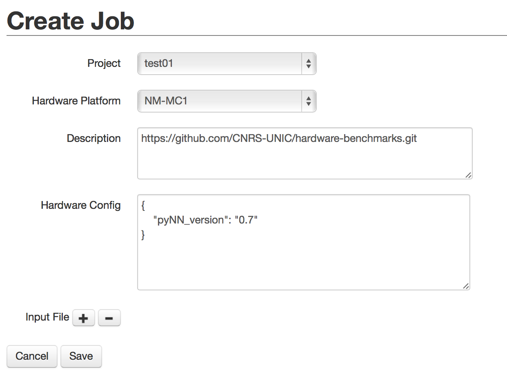
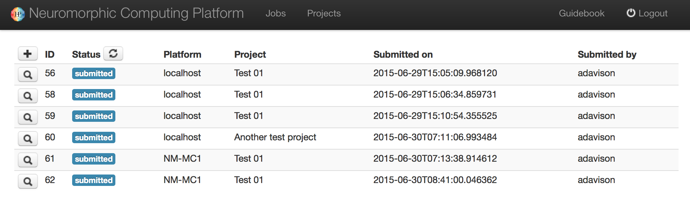
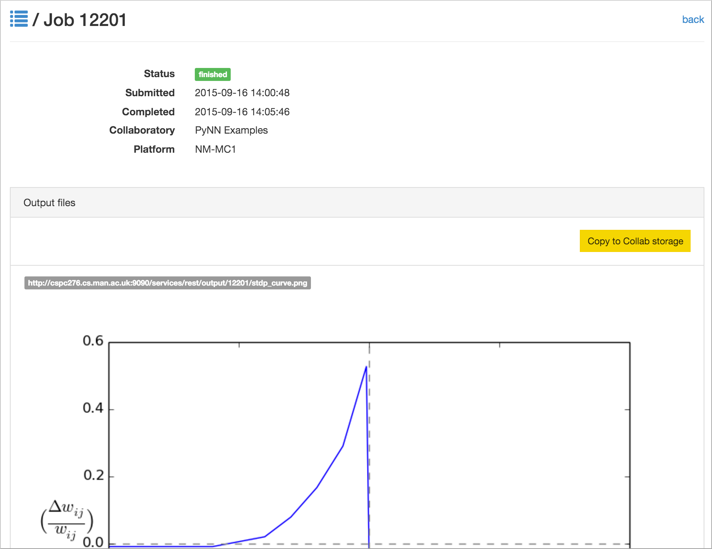

===================
Running simulations
===================

The Neuromorphic Computing Platform of the `Human Brain Project`_ contains two very different neuromorphic hardware
systems - BrainScaleS (also known as "NM-PM-1", "physical model") and SpiNNaker (also known as "NM-MC-1", "many core") - but has a single interface.

Jobs are written as Python scripts using the PyNN API, submitted to a queue server, then executed on one of the
neuromorphic systems. On job completion, the user may retrieve the results of the simulation/emulation.

There are several ways of interacting with the queue server. This document describes the web interface, the Python
client and the command-line client.

Format of a job
===============

Whether using the web interface or the Python client, a job for the HBP Neuromorphic Computing
Platform consists of:

* an experiment description
* input data
* hardware platform configuration

Experiment description
----------------------

The experiment description takes the form of a Python script using the PyNN API. You must provide one of:

* a single script, uploaded as part of the job submission or pasted into the web form
* the file path of a single script located on your local machine (Python client only)
* the URL of a public Git repository
* the URL of a zip or tar.gz archive

In the latter two cases, you may optionally specify the path to the main Python script you wish
to run, together with any command-line arguments. The command-line arguments may contain a
placeholder, "``{system}``", which will be replaced with the name of the PyNN backend module
to be used (e.g. "spinnaker"). Example::

    main.py --option1=42 {system}

If the path is not specified, the script is assumed to be named :file:`run.py`,
i.e. the default is::

    run.py {system}

Input data
----------

Input data are specified as a list of data items. Each data item is the URL of a data file that should be downloaded
and placed in the job working directory. If your input data files are contained within your Git repository or zip
archive, you do not need to specify them here.

Hardware platform configuration
-------------------------------

Here you must choose the hardware system to be used ("BrainScaleS" for the Heidelberg system,
"SpiNNaker" for the Manchester system, "BrainScaleS-ESS" for the software simulator of the BrainScaleS system,
or "Spikey" for the Heidelberg single-chip system) and specify any
specific configuration options for the hardware system you have chosen.

SpiNNaker
~~~~~~~~~
On SpiNNaker, the "Hardware Config" box accepts a JSON-formatted object, with the following fields:

:"spynnaker_version":
  The git tag or branch to run.  If a "semantic" version is specified, each part
  of the tools will download a "matching" semantic version if possible, or use
  git master if no match is found.  If any other name is used, each part of the
  tools will attempt to use a matching branch or tag from git, or git master if
  no match is found.

:"spinnaker_tools_version":
  By default, a version of spinnaker tools will be used that works with the
  software version used above.  If another version is required for any reason,
  this can be overridden here.

:"extra_pip_installs":
  Specifies an array of additional libraries that should be installed using pip.

:"extra_git_repositories":
  Specifies an array of additional git repositories that should be cloned.  The
  repository will be cloned into a sub-folder of the "current working directory"
  on the system, and so can be made use of when specifying the options below.

:"extra_makes":
  Specifies an array of additional folders in which "make" should be called.

:"extra_python_setups":
  Specifies an array of additional folders in which to run "python setup.py install".

Example:
::
    {
    "spynnaker_version": "master",
    "spinnaker_tools_version": "3.1.0",
    "extra_pip_installs": ["elephant"],
    "extra_git_repositories": ["https://github.com/SpiNNakerManchester/SpiNNakerGraphFrontEnd"],
    "extra_makes": ["SpiNNakerGraphFrontEnd/spinnaker_graph_front_end/examples"],
    "extra_python_setups": ["SpiNNakerGraphFrontEnd"]
    }

.. commenting out a todo:: list configuration options for the different systems

.. _using-the-web-interface:

Using the web interface
=======================

Setting up your Collab
----------------------

The neuromorphic computing platform can be accessed from within the HBP Collaboratory using the
"Neuromorphic Computing Platform Job Manager v2" app and the "Neuromorphic Computing Platform Resource Manager" app.

To create a new Collab which already contains these two apps,
go to the `Neuromorphic Computing Platform collab`_ and click on :guilabel:`Create a Collab` or
:guilabel:`Get Started!` To add the apps to an existing Collab, click :guilabel:`ADD` in the
Navigation panel, and then select each of the apps in the list.

.. _access-requests:

Requesting access to the platform
---------------------------------

In your Collab, click on :guilabel:`Resource Manager`, and fill in the form.

.. image:: images/resource_request_form.png
   :width: 70%
   :align: center

The project description should contain a scientific or technical motivation for using the platform,
and should specify which of the Neuromorphic Computing Systems ("BrainScaleS" and/or "SpiNNaker")
you wish to use.

Three forms of access are available:

    Test access
        Only a brief abstract is required explaining why you wish to use the platform.
        It is not necessary to fill in the "Project description" field.
        No previous experience with the platform is required.
        A fixed quota of 5000 core-hours (for the SpiNNaker system)
        and/or 0.1 wafer-hours (for the BrainScaleS system) will be allocated,
        together with temporary storage of 1 GB.

    Preparatory access
        Only a short technical motivation is required.
        Previous experience with the platform (through a test access) is expected.
        A fixed quota of 500000 core-hours (for the SpiNNaker system)
        and/or 10 wafer-hours (for the BrainScaleS system) will be allocated,
        subject to a brief technical review,
        together with temporary storage of 10 GB.

    Project access
        For projects requiring more than the test/preparatory quotas, a scientific motivation
        of about one page should be provided, and a request for resources (in core-hours,
        wafer-hours and/or GB of storage) should be specified, and justified with respect to the
        project's scientific goals. This proposal will receive both scientific and technical
        reviews.

Do not forget to specify which type of access you are requesting,
and which of the Neuromorphic Computing Systems ("BrainScaleS", "Spikey"
and/or "SpiNNaker") you wish to use.

Access is granted on a per-collab basis, not per-person. All members of this collab will be able to make use of the quota.
All collab members will also be asked to sign and return a User Agreement form.

Once the resource request is granted, the :guilabel:`Resource Manager` will display the
quota usage.

.. commenting out a todo:: include screenshot of quota usage page.

.. _running-jobs:

Submitting a simulation job
---------------------------

To submit a simulation job to the Platform, click on :guilabel:`Job Manager`.

You will see a list of jobs you have submitted to the platform.
The first time you connect, of course, this list will be empty.

To create a new simulation job click on the :guilabel:`'+'` icon or the :guilabel:`New Job` button.

In this dialog, you must choose the project with which the job is associated, the hardware
platform on which you wish to run ("BrainScaleS", "SpiNNaker", "BrainScaleS-ESS" or "Spikey"), and provide the Python script which
should be run, either by copy-and-pasting the script into the "Code" box,

or by giving the URL of a version control repository or zip/tar archive together with a command-line
invocation.

.. image:: images/create_job_git.png
   :width: 70%
   :align: center

In your Python script you should avoid hard-coding the name of the PyNN backend to run, as
this will differ depending on the platform. Instead, your script should read the name of the
backend from the command-line. With PyNN 0.8, this can be achieved using:

.. code-block:: python

    from pyNN.utility import get_simulator
    sim, options = get_simulator()

    sim.setup(...)
    p = sim.Population(...)

For PyNN 0.7, see :ref:`using-different-backends`.

The "Hardware config" box is optional, but may contain extra configuration options in JSON
format (similar to the syntax for dictionaries in Python).

.. note:: more information on the available configuration options for the different hardware
          systems will be provided soon.

It is possible to provide input data files to the simulation. The files must be accessible
online.

After clicking "Submit" the job will be submitted to the queue, and will appear in the list of
jobs with a "submitted" label.

You will receive e-mail notifications when the job starts running and when it completes.

Retrieving the results of a job
-------------------------------

Once the job is completed, click on the magnifying glass icon to see the job results and
download the output data files.

Using the Python client
=======================

The Python client allows scripted access to the Platform. The same client software is used both by end users for
submitting jobs to the queue, and by the hardware systems to take jobs off the queue and to post the results.

Installing the Python client
----------------------------

Install the nmpi_client package from PyPI into a virtual environment, using for example
virtualenv or Anaconda. The client works with Python 2.7 and Python 3.5 or newer.

::

  $ pip install hbp_neuromorphic_platform

Configuring the client
----------------------

Before using the Neuromorphic Computing Platform you must have an HBP account, have created at
least one Collab, and have obtained a compute quota as described above under :ref:`access-requests`.

To interact with the Platform, you first create a :class:`Client` object with your HBP username:

.. code-block:: python

    import nmpi

    c = nmpi.Client("myusername")

This will prompt you for your password.

After you have connected once with your password, the platform provides a token which you
can save to a file and use in place of the password.

.. code-block:: python

    token = c.token

    new_client = Client("myusername", token=token)

This token will eventually expire. When it does, reconnect with your password to obtain a new token.

Submitting a job
----------------

Simple example: a single file on your local machine, no input data or parameter files.

.. code-block:: python

    job_id = c.submit_job(source="/Users/alice/dev/pyNN_0.7/examples/IF_cond_exp.py",
                          platform=nmpi.BRAINSCALES,
                          collab_id=563)

The Collab ID is the first number in the URL of your Collab, e.g. ``https://collab.humanbrainproject.eu/#/collab/563/nav/5043``.

You can get a list of all your Collabs using:

.. code-block:: python

   collabs = c.my_collabs()

A more complex example: the experiment and model description are contained in a Git repository. The input to the
network is an image file taken from the internet.

.. code-block:: python

    job_id = c.submit_job(source="https://github.com/apdavison/nmpi_test",
                          platform=nmpi.SPINNAKER,
                          collab_id=141,
                          inputs=["http://aloi.science.uva.nl/www-images/90/90.jpg"],
                          command="run.py {system}")

Monitoring job status
---------------------

.. code-block:: python

    >>> c.job_status(job_id)
    u'submitted'

Retrieving the results of a job
-------------------------------

.. code-block:: python

    >>> job = c.get_job(job_id, with_log=True)
    >>> from pprint import pprint
    >>> pprint(job)
    {u'code': u'https://github.com/apdavison/nmpi_test',
     u'hardware_config': u'',
     u'hardware_platform': u'SpiNNaker',
     u'id': 19,
     u'input_data': [{u'id': 34,
                      u'resource_uri': u'/api/v1/dataitem/34',
                      u'url': u'http://aloi.science.uva.nl/www-images/90/90.jpg'}],
     u'log': u'',
     u'output_data': [{u'id': 35,
                      u'resource_uri': u'/api/v1/dataitem/35',
                      u'url': u'http://example.com/my_output_data.h5'}],
     u'collab_id': 141,
     u'resource_uri': u'/api/v1/queue/19',
     u'status': u'finished',
     u'timestamp_completion': u'2014-08-13T21:02:37.541732',
     u'timestamp_submission': u'2014-08-13T19:40:43.964541',
     u'user': u'myusername'}

To download the data files generated by your simulation:

.. code-block:: python

    filenames = download_data(self, job, local_dir=".")

Deleting a job
--------------

.. code-block:: python

    >>> remove_completed_job(job_id)   # for jobs with status "finished" or "error"
    >>> remove_queued_job(job_id)      # for jobs with status "submitted"

Using the command-line
======================

A third way to interact with the HBP Neuromorphic Computing Platform
is to use the command-line client, :program:`nmpi`.
This aims to mimic as closely as possible the experience of running simulations on a local machine,
even though the job is actually running on the large BrainScaleS or SpiNNaker systems.
In particular, your Python code (e.g. your PyNN scripts) can be on your local machine,
and all simulation results will be downloaded to your local machine.

Installing the command-line client
----------------------------------

The command-line client is based on, and included with, the Python client.
Installing the Python client, as descibed above, also gives you the :program:`nmpi` tool.

Configuring the client
----------------------

In the directory from which you want to run simulations,
usually the directory containing your PyNN scripts,
create a file named :file:`nmpi_config.yml`,
which should look something like this:

.. code-block:: yaml

   username: yourusername
   collab_id: 563
   default_platform: SpiNNaker
   default_output_dir: .

You can use the id of any Collab in which you have a valid quota (see :ref:`access-requests` above.

Submitting a job
----------------

.. code-block:: bash

   $ nmpi run myscript.py

This will ask for your HBP password the first time you run it.
Subsequent runs will use the stored authentication token until it expires,
at which time you will be asked again for your password.

All of the Python code in your current directory (and any subdirectories)
will be uploaded to the Collaboratory storage (for the Collab ID in your config file).
On subsequent runs, only files that have changed will be uploaded.

The job will then be submitted to the queue for the default system,
as defined in your config file, and the :program:`nmpi` command will wait
until the job has been completed, and then download the simulation results
to the default output directory.

To submit a job to a different system than defined in your config, use the :option:`-p` option,
and to download data to a different output directory, use the :option:`-o` option, e.g.

.. code-block:: bash

   $ nmpi run -p BrainScaleS -o results myscript.py

Submitting a batch job
----------------------

If the platform is very busy, you know that your simulation will take a long time to run,
or you wish to submit several jobs at one time, you may not wish to wait until the job has finished.
In that scenario, you can submit in batch mode:

.. code-block:: bash

   $ nmpi run -b myscript.py

With this option, the :program:`nmpi` command will return immediately.
At a later time, you can run:

.. code-block:: bash

   $ nmpi check

to check whether your jobs have finished.
For those that have, the simulation results will be downloaded to your local machine.

.. _`Human Brain Project`: http://www.humanbrainproject.eu
.. _`HBP Collaboration Server`: https://collaboration.humanbrainproject.eu
.. _`Neuromorphic Computing Platform collab`: https://collab.humanbrainproject.eu/#/collab/51/nav/244
