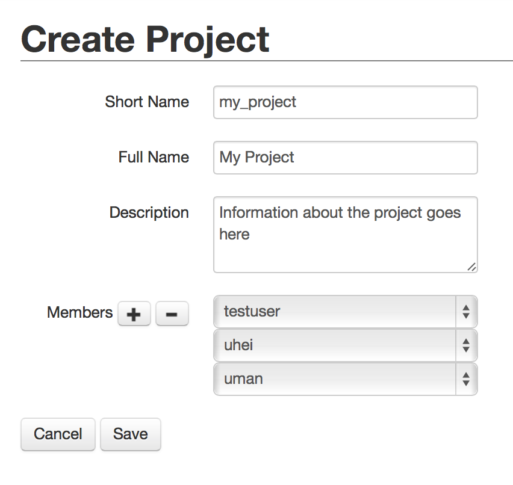

===================
Running simulations
===================

The Neuromorphic Computing Platform of the `Human Brain Project`_ contains two very different neuromorphic hardware
systems - NM-PM-1 ("physical model") and NM-MC-1 ("many core") - but has a single interface.

Jobs are written as Python scripts using the PyNN API, submitted to a queue server, then executed on one of the
neuromorphic systems. On job completion, the user may retrieve the results of the simulation/emulation.

There are several ways of interacting with the queue server. This document describes the web interface and the Python
client.

Format of a job
===============

Whether using the web interface or the Python client, a job for the HBP Neuromorphic Computing
Platform consists of:

  * an experiment description
  * input data
  * hardware platform configuration
  * a project name

Experiment description
----------------------

The experiment description takes the form of a Python script using the PyNN API. You must provide one of:

  * a single script, uploaded as part of the job submission
  * the file path of a single script located on your local machine (Python client only)
  * the URL of a public Git repository
  * the URL of a zip or tar.gz archive

In the latter two cases, the respository or archive must contain a top-level file named :file:`run.py`.
**The script must accept a single command-line argument**, the name of the backend (e.g. "nest", "spinnaker"). Any other parameters or
data files needed by the script should be provided as input files.

Input data
----------

Input data are specified as a list of data items. Each data item is the URL of a data file that should be downloaded
and placed in the job working directory. If your input data files are contained within your Git repository or zip
archive, you do not need to specify them here.

Hardware platform configuration
-------------------------------

Here you must choose the hardware system to be used ("NM-PM1" for the Heidelberg system, "NM-MC1" for the
Manchester (SpiNNaker) system, or "sandbox" to test your script using the PyNN "mock" backend.) and specify any
specific configuration options for the hardware system you have chosen.

.. todo:: add options for running with ESS

.. todo:: list configuration options for NM-PM1 and NM-MC1 systems

Project
-------

Projects are a way of controlling who can access job results. Each job must be associated with a project.

.. _using-the-web-interface:

Using the web interface
=======================

The neuromorphic computing platform can be accessed at https://www.hbpneuromorphic.eu

.. note:: the platform will also soon be accessible from within the HBP Collaboratory

After logging in with your HBP credentials, you will see a list of simulation jobs you have
submitted to the platform. The first time you connect, of course, this list will be empty.

To create a new project, click on "Projects" in the menu bar, then on the '+' icon.

By default, only the person who creates a project has access to it, and to any jobs
associated with the project. To give access to other people, use the '+' icon next to Members
then select the username from the drop-down list.

To create a new simulation job, return to the "Jobs" page, and click on the '+' icon.

.. image:: images/create_job.png
   :width: 70%
   :align: center

In this dialog, you must choose the project with which the job is associated, the hardware
platform on which you wish to run ("NM-PM1" or "NM-MC1"), and provide the Python script which
should be run, either by copy-and-pasting the script into the "Description" box, or by giving
the URL of a version control repository containing a file :file:`run.py` at the top-level.

In your Python script you should avoid hard-coding the name of the PyNN backend to run, as
this will differ depending on the platform. Instead, your script should read the name of the
backend from the command-line. With PyNN 0.8, this can be achieved using:

.. code-block:: python

    from pyNN.utility import get_simulator
    sim, options = get_simulator()

    sim.setup(...)
    p = sim.Population(...)

For PyNN 0.7, see :ref:`using-different-backends`.

The "Hardware config" box is optional, but may contain extra configuration options in JSON
format (similar to the syntax for dictionaries in Python).

.. note:: more information on the available configuration options for the different hardware
          systems will be provided soon.

It is possible to provide input data files to the simulation. The files must be accessible
online.

After clicking "Save" the job will be submitted to the queue, and will appear in the list of
jobs with a "submitted" label.

.. image:: images/job_list.png
   :width: 100%

You will receive e-mail notifications when the job starts running and when it completes.
Once the job is completed, click on the magnifying glass icon to see the job results and
download the output data files.

.. todo :: insert screenshot of job result page

Using the Python client
=======================

The Python client allows scripted access to the Platform. The same client software is used both by end users for
submitting jobs to the queue, and by the hardware systems to take jobs off the queue and to post the results.

Installing the Python client
----------------------------

Install the nmpi_client package from PyPI into a virtual environment, using for example
virtualenv or Anaconda. The client works with Python 2.7 and Python 3.3 or newer.

::

  $ pip install hbp_neuromorphic_platform

Configuring the client
----------------------

Before using the Neuromorphic Computing Platform you must have an HBP account.

To interact with the Platform, you first create a :class:`Client` object your username:

.. code-block:: python

    import nmpi

    c = nmpi.Client("myusername")

This will prompt you for your password. Alternatively, you can supply your password directly:

.. code-block:: python

    c = nmpi.Client(username="myusername", password="topsecret")

After you have connected once with your password, the platform provides a token which you
can save to a file and use in place of the password.

.. code-block:: python

    token = c.token

    new_client = Client("myusername", token=token)

This token will eventually expire. When it does, reconnect with your password to obtain a new token.

.. todo:: allow a configuration file (".nmpirc"?) for putting username, password in

Creating a new project
----------------------

Before submitting jobs, you must create at least one project. Each project must have a unique name,
containing only letters, numbers, underscores or hyphens.
We suggest using a "namespace" approach, e.g. prefix all project names with the name of your
university or laboratory.

.. code-block:: python

    c.create_project("my-testproject")

You can also specify a longer name, which need not be unique, and may include spaces and punctuation,
and a paragraph-length description of the project.

.. code-block:: python

    c.create_project("my-synfire",
                     full_name="Synfire Chain Network",
                     description="Simulations of a synfire chain network")

.. todo:: what happens if a project with that name already exists?

.. todo:: explain about project members

Submitting a job
----------------

Simple example: a single file on your local machine, no input data or parameter files.

.. code-block:: python

    job_id = c.submit_job(source="/Users/alice/dev/pyNN_0.7/examples/IF_cond_exp.py",
                          platform="NM-PM1",
                          project="my-testproject")

A more complex example: the experiment and model description are contained in a Git repository. The input to the
network is an image file taken from the internet.

.. code-block:: python

    job_id = c.submit_job(source="https://github.com/apdavison/nmpi_test",
                          platform="NM-MC1",
                          project="unic-testproject",
                          inputs=["http://aloi.science.uva.nl/www-images/90/90.jpg"])

Monitoring job status
---------------------

.. code-block:: python

    >>> c.job_status(job_id)
    u'submitted'

Retrieving the results of a job
-------------------------------

.. code-block:: python

    >>> job = c.get_job(job_id)
    >>> from pprint import pprint
    >>> pprint(job)
    {u'experiment_description': u'https://github.com/apdavison/nmpi_test',
     u'hardware_config': u'',
     u'hardware_platform': u'NM-MC1',
     u'id': 19,
     u'input_data': [{u'id': 34,
                      u'resource_uri': u'/api/v1/dataitem/34',
                      u'url': u'http://aloi.science.uva.nl/www-images/90/90.jpg'}],
     u'log': u'',
     u'output_data': [{u'id': 35,
                      u'resource_uri': u'/api/v1/dataitem/35',
                      u'url': u'http://example.com/my_output_data.h5'}],
     u'project': u'/api/v1/project/1',
     u'resource_uri': u'/api/v1/queue/19',
     u'status': u'finished',
     u'timestamp_completion': u'2014-08-13T21:02:37.541732',
     u'timestamp_submission': u'2014-08-13T19:40:43.964541',
     u'user': u'/api/v1/user/myusername'}

.. todo:: explain how to download data files

.. _`Human Brain Project`: http://www.humanbrainproject.eu
.. _`HBP Collaboration Server`: https://collaboration.humanbrainproject.eu

